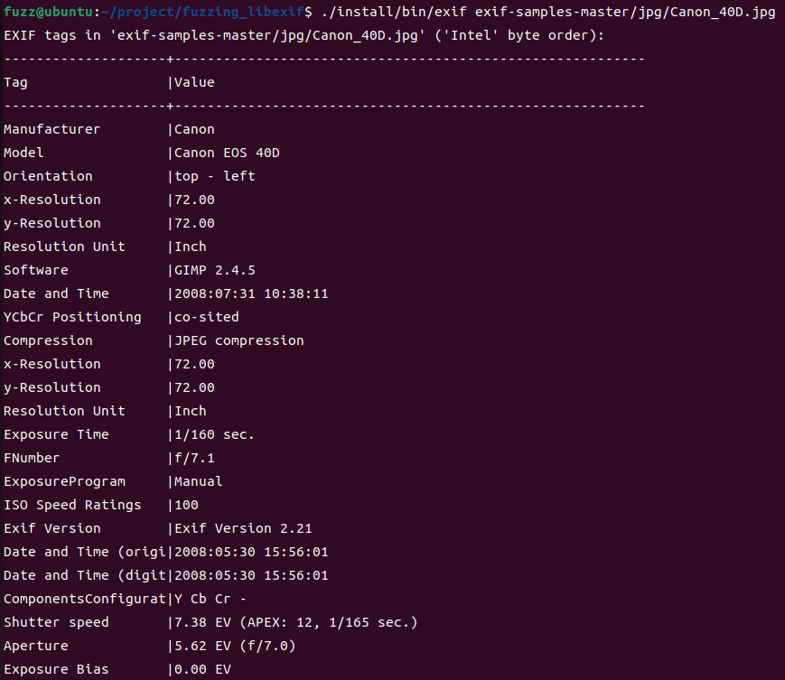
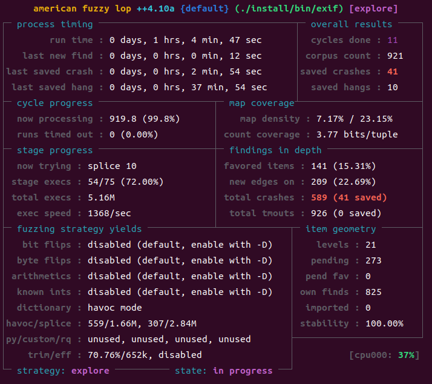
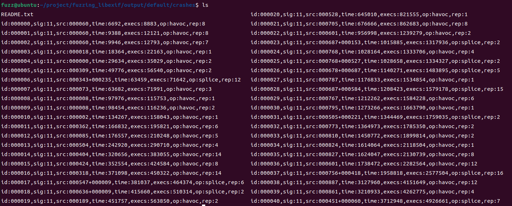
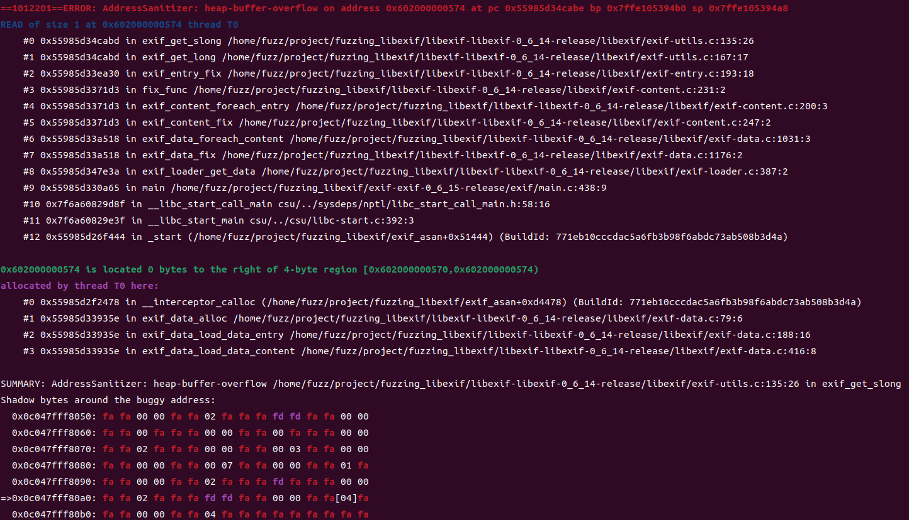
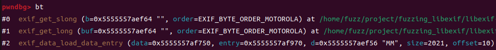
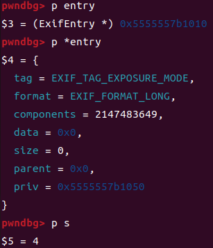
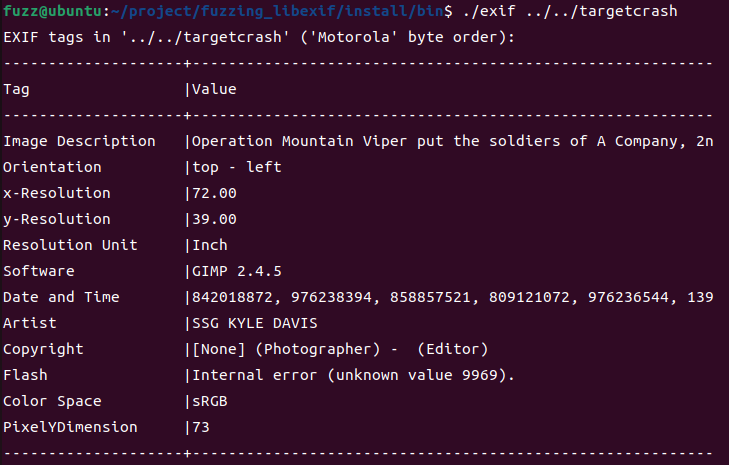

Fuzzing libexif-0.6.14 (From Fuzzing101 - Exercise 2)
=======================================================

libexif는 디지털 카메라에서 이미지 파일에 사용하는 표준 메타 데이터 포맷인 EXIF(Exchangeable Image File Format) 데이터를 파싱, 편집 등의 기능을 갖고 있는 라이브러리이다. libexif에서 [CVE-2009-3895](https://knvd.krcert.or.kr/elkDetail.do?CVEID=CVE-2009-3895&jvn=&CVEID=CNNVD-200911-213&dilen=60c15fa1dd82393915ad3109) 취약점과, [CVE-2012-2836](https://knvd.krcert.or.kr/elkDetail.do?CVEID=CVE-2012-2836&jvn=&CVEID=CNNVD-201207-183&dilen=60c0642cdd82393915a39901) 취약점이 발견되었다. 퍼징을 통해 크래시를 찾고 분석해보자. 

## Find an interface application that makes use of the libexif library

우선 타겟인 libexif-0.6.14를 다운로드 후 afl-clang-lto를 이용해 빌드한다.
* Download and build libexif-0.6.14 with afl-clang-lto
```bash
$ mkdir ~/project/fuzzing_libexif && cd ~/project/fuzzing_libexif
$ wget https://github.com/libexif/libexif/archive/refs/tags/libexif-0_6_14-release.tar.gz
$ tar -xvzf libexif-0_6_14-release.tar.gz && cd libexif-libexif-0_6_14-release/
$ autoreconf -fvi
$ CC=afl-clang-lto ./configure --enable-shared=no --prefix="$HOME/project/fuzzing_libexif/install/"
$ make
$ make install
```
libexif는 라이브러리이기 때문에 libexif를 사용하는 프로그램을 찾아서 빌드해야한다. libexif의 JPEG 파일의 EXIF 정보를 보여주는 cli 프로그램인 exif 0.6.15 버전을 사용한다. 
* Download and build exif-0.6.15 whit afl-clang-lto
```bash
$ wget https://github.com/libexif/exif/archive/refs/tags/exif-0_6_15-release.tar.gz
$ tar -xvzf exif-0_6_15-release.tar.gz && cd exif-exif-0_6_15-release/
$ autoreconf -fvi
$ CC=afl-clang-lto ./configure --enable-shared=no --prefix="$HOME/project/fuzzing_libexif/install/" PKG_CONFIG_PATH=$HOME/project/fuzzing_libexif/install/lib/pkgconfig
$ make
$ make install
```

## Seed corpus creation
초기 테스트 케이스 준비를 위해 간단한 exif 샘플을 다운로드한다. 
```bash
$ cd ~/project/fuzzing_libexif
$ wget https://github.com/ianare/exif-samples/archive/refs/heads/master.zip
$ unzip master.zip
```
샘플을 이용해 exif가 잘 작동하는지 확인해본다.

    $ ./install/bin/exif exif-samples-master/jpg/Canon_400.jpg



샘플 이미지에 있는 숨겨진 EXIF 메타 데이터 정보를 확인할 수 있다. 

## Fuzz
모든 준비가 끝났으니 퍼징을 해본다. 
```bash
$ afl-fuzz -i exif-samples-master/jpg/ -o ./output -s 123 -- ./install/bin/exif @@
```






약 1시간 4분 퍼징한 결과 41개의 saved crash가 발생했다. 모두 sig 11로 Segmentation Fault를 발생하는 크래시이다. 

## Reproduce crashes
41개의 크래시에 대해 모두 reproduce 해본다. exif_fuzz는 위에서 빌드한 exif의 복사본이다. 
```bash
for file in $HOME/project/fuzzing_libexif/output/default/crashes/*;
do
    $HOME/project/fuzzing_libexif/exif_fuzz $file
done
```
위 쉘 스크립트를 실행해보면, 
> ./reproduce.sh: 줄 3: 999884 세그멘테이션 오류 ./exif_fuzz $file
./reproduce.sh: 줄 3: 999885 세그멘테이션 오류 ./exif_fuzz $file
./reproduce.sh: 줄 3: 999886 세그멘테이션 오류 ./exif_fuzz $file
./reproduce.sh: 줄 3: 999887 세그멘테이션 오류 ./exif_fuzz $file
./reproduce.sh: 줄 3: 999888 세그멘테이션 오류 ./exif_fuzz $file
./reproduce.sh: 줄 3: 999889 세그멘테이션 오류 ./exif_fuzz $file
./reproduce.sh: 줄 3: 999890 세그멘테이션 오류 ./exif_fuzz $file
./reproduce.sh: 줄 3: 999891 세그멘테이션 오류 ./exif_fuzz $file
./reproduce.sh: 줄 3: 999892 세그멘테이션 오류 ./exif_fuzz $file
./reproduce.sh: 줄 3: 999893 세그멘테이션 오류 ./exif_fuzz $file
./reproduce.sh: 줄 3: 999894 세그멘테이션 오류 ./exif_fuzz $file
./reproduce.sh: 줄 3: 999895 세그멘테이션 오류 ./exif_fuzz $file
./reproduce.sh: 줄 3: 999896 세그멘테이션 오류 ./exif_fuzz $file
./reproduce.sh: 줄 3: 999897 세그멘테이션 오류 ./exif_fuzz $file
./reproduce.sh: 줄 3: 999898 세그멘테이션 오류 ./exif_fuzz $file
./reproduce.sh: 줄 3: 999899 세그멘테이션 오류 ./exif_fuzz $file
./reproduce.sh: 줄 3: 999900 세그멘테이션 오류 ./exif_fuzz $file
./reproduce.sh: 줄 3: 999901 세그멘테이션 오류 ./exif_fuzz $file
./reproduce.sh: 줄 3: 999902 세그멘테이션 오류 ./exif_fuzz $file
./reproduce.sh: 줄 3: 999903 세그멘테이션 오류 ./exif_fuzz $file
./reproduce.sh: 줄 3: 999904 세그멘테이션 오류 ./exif_fuzz $file
./reproduce.sh: 줄 3: 999905 세그멘테이션 오류 ./exif_fuzz $file
./reproduce.sh: 줄 3: 999906 세그멘테이션 오류 ./exif_fuzz $file
./reproduce.sh: 줄 3: 999907 세그멘테이션 오류 ./exif_fuzz $file
./reproduce.sh: 줄 3: 999908 세그멘테이션 오류 ./exif_fuzz $file
./reproduce.sh: 줄 3: 999909 세그멘테이션 오류 ./exif_fuzz $file
./reproduce.sh: 줄 3: 999910 세그멘테이션 오류 ./exif_fuzz $file
./reproduce.sh: 줄 3: 999911 세그멘테이션 오류 ./exif_fuzz $file
./reproduce.sh: 줄 3: 999912 세그멘테이션 오류 ./exif_fuzz $file
./reproduce.sh: 줄 3: 999913 세그멘테이션 오류 ./exif_fuzz $file
./reproduce.sh: 줄 3: 999914 세그멘테이션 오류 ./exif_fuzz $file
./reproduce.sh: 줄 3: 999915 세그멘테이션 오류 ./exif_fuzz $file
./reproduce.sh: 줄 3: 999916 세그멘테이션 오류 ./exif_fuzz $file
./reproduce.sh: 줄 3: 999917 세그멘테이션 오류 ./exif_fuzz $file
./reproduce.sh: 줄 3: 999918 세그멘테이션 오류 ./exif_fuzz $file
./reproduce.sh: 줄 3: 999919 세그멘테이션 오류 ./exif_fuzz $file
./reproduce.sh: 줄 3: 999920 세그멘테이션 오류 ./exif_fuzz $file
./reproduce.sh: 줄 3: 999921 세그멘테이션 오류 ./exif_fuzz $file
./reproduce.sh: 줄 3: 999922 세그멘테이션 오류 ./exif_fuzz $file
./reproduce.sh: 줄 3: 999923 세그멘테이션 오류 ./exif_fuzz $file
./reproduce.sh: 줄 3: 999924 세그멘테이션 오류 ./exif_fuzz $file

모든 크래시에 대해 Segmentation Fault가 발생했음을 확인할 수 있다.  프로그램을 ASAN을 이용해 빌드하고 다시 reproduce함으로써 어디서 크래시가 터졌는지 확인해보자. 
* Build the programs with ASAN
```bash
$ rm -r ~/project/fuzzing_libexif/install
$ cd ~/project/fuzzing_libexif/libexif-libexif-0_6_14-release/
$ make clean
$ CC="clang -fsanitize=address" ./configure --enable-shared=no --prefix="$HOME/project/fuzzing_libexif/install"
$ make
$ make install
$ cd ../exif-exif-0_6_15-release/
$ make clean
$ CC="clang -fsanitize=address" ./configure --enable-shared=no --prefix="$HOME/project/fuzzing_libexif/install" PKG_CONFIG_PATH=$HOME/project/fuzzing_libexif/install/lib/pkgconfig
$ make
$ make install
$ cp ../install/bin/exif ../exif_asan
```
id:000020 크래시를 targetcrash로 rename하고 reproduce 해본다.
* Reproduce the target crash
```bash
$ cp ~/project/fuzzing_libexif/output/default/crahses/id:000020~~~ ~/project/fuzzing_libexif/targetcrash
$ ~/project/fuzzing_libexif/exif_asan ~/project/fuzzing_libexif/targetcrash
```



exif-utils.c의 exif_get_slong에서 heap-based buffer overflow가 발생했음을 확인할 수 있다. 

## Triage
* exif_get_slong (in exif-utils.c)
```C
ExifSLong
exif_get_slong (const unsigned char *b, ExifByteOrder order)
{
	if (!b) return 0;
        switch (order) {
        case EXIF_BYTE_ORDER_MOTOROLA:
                return ((b[0] << 24) | (b[1] << 16) | (b[2] << 8) | b[3]); // [1]
        case EXIF_BYTE_ORDER_INTEL:
                return ((b[3] << 24) | (b[2] << 16) | (b[1] << 8) | b[0]);
        }

	/* Won't be reached */
	return (0);
}
```

힙 기반 버퍼 오버플로우가 발생한 위 함수는 4바이트 배열 b를 주어진 바이트 배열 순서대로 재배치해 리턴하는 함수이다. 인자로 주어진 order가 EXIF_BYTE_ORDER_MOTOROLA인 경우 b를 빅 엔디안 형식으로 배열해 리턴하고, EXIF_BYTE_ORDER_INTEL인 경우 리틀 엔디안 형식으로 배열해 리턴한다. 디버깅을 통해 힙 기반 버퍼 오버플로우가 어떻게 발생하는지 확인해보자. [1] 라인에 중단점을 설정하고 backtrace로 어떻게 함수가 호출되는지 확인해보았다. 



exif_data_load_data_entry 함수에서 exif_get_long(slong과 동일)을 호출하고 있다. 이 함수는 이미지 파일로부터 EXIF 데이터가 들어갈 각 엔트리에 적절하게 값을 파싱해서 할당 및 저장하고 있다. 엔트리에는 tag, format, components, data 등의 변수가 포함되는데, components는 데이터 요소의 개수이고 data는 실제 데이터가 저장되는 주소의 포인터이다. 

* 구조체 ExifEntry
```c
struct _ExifEntry {
        ExifTag tag;
        ExifFormat format;
        unsigned long components;

        unsigned char *data;
        unsigned int size;

	/* Content containing this entry */
	ExifContent *parent;

	ExifEntryPrivate *priv;
};
```
exif_data_load_data_entry 에서 각 entry의 tag, format, components를 저장하고 data가 저장될 공간을 할당하고 memcpy로 데이터 내용을 data에 저장한다. 이 때 할당되는 메모리의 크기는 format과 components에 의해 결정되는데, 각 format에 맞는 데이터 요소의 크기(ASCII인 경우 1byte, long인 경우 4byte 등)에 components를 곱한만큼 메모리를 할당한다. 그런데, 0x5555557b1010 번지에 저장되는 엔트리에서 문제가 발생한다. exif_data_load_data_entry에 중단점을 설정하고 살펴보자. 



0x5555557b1010 번지에 저장되는 엔트리의 format은 long(4byte)이고, components는 2147483649이다. 따라서 할당될 메모리의 크기(변수 s에 저장)는 4 * 2147483649인 8589934596가 되어야 하지만 변수 s는 unsigned int이므로 integer overflow에 의해 4바이트가 된다. 따라서 실제로 해당 엔트리에 할당된 데이터 공간은 4바이트 공간이다. 

모든 엔트리가 저장된 후 exif_entry_fix 함수에서 각 엔트리에 대해 데이터 및 포맷의 조정을 수행한다. 여기서 직접적인 heap-based BOF가 발생한다.

* exif_entry_fix (in exif-entry.c)
```c
...
	case EXIF_TAG_CONTRAST:
	case EXIF_TAG_SHARPNESS:
		switch (e->format) {
		case EXIF_FORMAT_LONG:
			if (!e->parent || !e->parent->parent) break;
			o = exif_data_get_byte_order (e->parent->parent);
			for (i = 0; i < e->components; i++)
				exif_set_short (
					e->data + i *
					exif_format_get_size (
					EXIF_FORMAT_SHORT), o,
					(ExifShort) exif_get_long (
					e->data + i *
					exif_format_get_size (
					EXIF_FORMAT_LONG), o));
...
```
엔트리의 components만큼 for문을 반복하며 exif_set_short 등의 함수를 호출하고 있다. 0x5555557b1010 번지 엔트리의 경우 components가 2147483649인데 data 공간은 4바이트 공간이다. 따라서 exif_set_short 등의 함수에서 조작하는 영역이 e->data의 영역이 아닌 다른 힙 영역의 데이터를 조작하게 된다. 

요약하면, 엔트리의 데이터에 할당되는 메모리가 integer overflow로 인해 실제로 필요한 크기만큼 할당되지 않았기 때문에 힙 기반 버퍼 오버플로우가 발생하는 것이다. 

## Fix the issue
가장 확실한 해결법은 변수 s 저장 후 integer overflow가 발생하는지 체크하고, 발생했다면 해당 엔트리에 대해 데이터를 로드하지 않도록 하는 것이다. exif_data_load_data_entry 함수에서 sanity check 코드에 다음과 같은 코드를 추가했다.
```c
if (4294967295 / exif_format_get_size(entry->format) < entry->components)
        return 0;
```



수정 및 빌드 후 targetcrash에 대해 실행해보니 더 이상 Segmentation fault가 발생하지 않음을 확인할 수 있다.