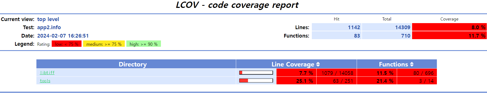
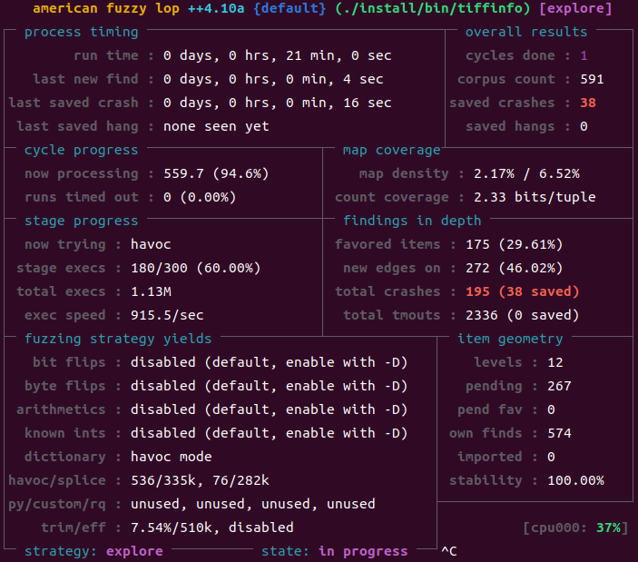

Fuzzing LibTIFF-4.0.4 (From Fuzzing101 - Exercise4)
==============================================
LibTIFF는 TIFF(Tagged Image File Format) 파일 포맷을 처리하는 라이브러리이다. TIFF는 복잡한 이미지 데이터를 저장하기 위한 포맷으로 여러 곳에서 널리 사용되고 있다. LibTIFF 4.0.4 버전에서 발견된 [CVE-2016-9297](https://knvd.krcert.or.kr/elkDetail.do?CVEID=CVE-2016-9297&jvn=&CVEID=CNNVD-201611-578&dilen=60c172d0dd82393915af6922) 취약점을 퍼징을 통해 분석하고 보완해보자. 

## Download and build the target
* Download and uncompress LibTIFF-4.0.4
```bash
$ mkdir $HOME/project/fuzzing_libtiff && cd $HOME/project/fuzzing_libtiff
$ wget https://download.osgeo.org/libtiff/tiff-4.0.4.tar.gz
$ tar -xvzf tiff-4.0.4.tar.gz
```
우선 instrumentation 코드를 삽입하지 않고 빌드 및 설치해 original 실행 파일을 복사해둔다.

* Build and install LibTIFF-4.0.4 without instrumentation
```bash
$ cd tiff-4.0.4
$ ./configure --prefix="$HOME/project/fuzzing_libtiff/install" --disable-shared
$ make
$ make install
$ cp $HOME/project/fuzzing_libtiff/install/bin/tiffinfo $HOME/project/fuzzing_libtiff/tiffinfo_original
```

## Code Coverage
이번 Exercise에서는 LCOV라는 소프트웨어를 사용해 Code coverage 데이터를 수집하고 이를 퍼징에 이용해 퍼징 효율을 높여볼 것이다. 우선 LCOV 패키지를 설치한다.

* Install LCOV
```bash
$ sudo apt update
$ sudo apt install lcov
```
이제 LibTIFF를 --coverage 플래그를 추가해 다시 빌드한다. --coverage 플래그를 추가해야 Code coverage 정보를 수집하기 위한 instrumentation이 삽입된다. 

* Rebuild and install LibTIFF-4.0.4 with '--coverage' flag
```bash
$ cd $HOME/project/fuzzing_libtiff
$ rm -r install
$ cd tiff-4.0.4
$ make clean
$ CFLAGS="--coverage" LDFAGS="--coverage" ./configure --prefix="$HOME/project/fuzzing_libtiff/install" --disable-shared
$ make
$ make install
$ cp ../install/bin/tiffinfo ../tiffinfo_lcov
```
LCOV를 이용해 Code coverage 정보를 수집하고 이를 html 파일로 생성해 시각적으로 확인할 수 있다. 

* Collect the code coverage data and generate html output
```bash
$ lcov --zerocounters --directory ./
$ lcov --capture --initial --directory ./ --output-file app.info
$ ../tiffinfo_lcov -D -j -c -r -s -w ./test/images/palette-1c-1b.tiff
$ lcov --no-checksum --directory ./ --capture --output-file app2.info
$ genhtml --highlight --legend -output-directory ./html-coverage ./app2.info
```
각 명령어 라인별로 수행하는 일은 다음과 같다.
1. lcov --zerocounters --directory ./ : 현재 디렉토리의 커버리지 카운터를 0으로 초기화한다. 이전 실행에서 수집된 데이터를 초기화하는 명령어이다.
2. lcov --capture --initial --directory ./ --output-file app.info : 초기 커버리지 데이터를 캡쳐해 app.info 파일에 저장한다. 프로그램 실행 전의 커버리지 상태를 캡쳐해 실행 이후 데이터와 비교하기 위한 기준으로 사용된다. 
3. ../tiffinfo_lcov -D -j -c -r -s -w ./test/images/palette-1c-1b.tiff : 커버리지를 분석할 프로그램을 실행한다. 사용된 옵션들은 커버리지를 높이기 위해 사용되었다. 옵션에 대한 자세한 내용은 -h 옵션을 통해 확인할 수 있다.
4. lcov --no-checksum --directory ./ --capture --output-file app2.info : 체크섬 검사를 비활성화해 처리 속도를 높이고 수집된 커버리지 데이터를 app2.info 파일에 저장한다.
5. genhtml --highlight --legend -output-directory ./html-coverage ./app2.info : app2.info에 캡쳐된 커버리지 데이터를 바탕으로 html-coverage 디렉토리에 Code coverage report를 html 파일로 생성한다. --highlight와 --legend 옵션은 색상 강조, 범례를 추가해 더 보기 좋은 report를 생성한다.

위 작업을 통해 생성된 html 파일을 열면 다음과 같이 Code coverage를 확인할 수 있다. 



html 파일에서 디렉토리, 파일 등을 클릭해 각 라인이 실행되었는지 확인할 수 있다. 

## Rebuild LibTiff-4.0.4 and Fuzz
실제 퍼징을 위해 LibTIFF를 AFL, ASAN을 이용해 다시 빌드한다.

* Rebuild LibTIFF-4.0.4 with afl-clang-lto and ASAN
```bash
$ rm -r ../install
$ make clean
$ AFL_USE_ASAN=1 CC=afl-clang-lto ./configure --prefix="$HOME/project/fuzzing_libtiff/install" --disable-shared
$ AFL_USE_ASAN=1 make -j4
$ AFL_USE_ASAN=1 make install
```
make에 -j4 옵션은 4개의 코어를 사용해 빌드하도록 하는 옵션이다. 기본적으로 make는 한 개의 코어만 사용하기 때문에 빌드 가속화를 위해 -j4 옵션으로 독립적인 컴파일 작업을 4개의 코어에서 병렬적으로 수행하도록 한다. 

퍼징을 진행해본다.
```bash
$ cd ~/project/fuzzing_libtiff
$ afl-fuzz -m none -i tiff-4.0.4/test/images/ -o ./output/ -s 123 -- ./install/bin/tiffinfo -D -j -c -r -s -w @@
```



21분간 퍼징 진행한 결과 38개의 saved crash가 발생했다. 

## Triage
발생한 crash를 모두 reproduce 해보자. ASAN 모드로 빌드했으므로 타겟 바이너리를 그대로 사용해도 된다. 간단한 쉘 스크립트로 모든 크래시에 대한 로그를 작성하고 grep으로 결과를 살펴본다.

* makelog.sh
```bash
for file in $HOME/project/fuzzing_libtiff/output/default/crashes/*;
do
        echo Input : $file >> crash.log
        $HOME/project/fuzzing_libtiff/install/bin/tiffinfo -D -j -c -r -s -w $file 2>> crash.log
done
```
makelog.sh를 실행하고 grep으로 ERROR 메시지만 찾아보자.
```bash
$ chmod +x makelog.sh
$ ./makelog.sh
$ grep ERROR crash.log
==1136878==ERROR: AddressSanitizer: heap-buffer-overflow on address 0x6020000000b1 at pc 0x560a1f0966d1 bp 0x7ffc2a37cdf0 sp 0x7ffc2a37c5b8
==1136880==ERROR: AddressSanitizer: heap-buffer-overflow on address 0x602000000111 at pc 0x556d60a186d1 bp 0x7ffee918f7f0 sp 0x7ffee918efb8
==1136882==ERROR: AddressSanitizer: heap-buffer-overflow on address 0x6020000000f2 at pc 0x5614e90786d1 bp 0x7fff49a814b0 sp 0x7fff49a80c78
==1136884==ERROR: AddressSanitizer: heap-buffer-overflow on address 0x6070000000d1 at pc 0x5625a55f16d1 bp 0x7ffd95ed6150 sp 0x7ffd95ed5918
==1136886==ERROR: AddressSanitizer: heap-buffer-overflow on address 0x6070000000d1 at pc 0x55df3f4606d1 bp 0x7ffcce4eee70 sp 0x7ffcce4ee638
==1136888==ERROR: AddressSanitizer: heap-buffer-overflow on address 0x6020000000b1 at pc 0x55b372d836d1 bp 0x7ffdeb0af490 sp 0x7ffdeb0aec58
==1136890==ERROR: AddressSanitizer: heap-buffer-overflow on address 0x603000000144 at pc 0x55ccc9a526d1 bp 0x7ffef8e822f0 sp 0x7ffef8e81ab8
==1136892==ERROR: AddressSanitizer: heap-buffer-overflow on address 0x6070000000d1 at pc 0x5622a5c286d1 bp 0x7ffc9cfd04d0 sp 0x7ffc9cfcfc98
==1136894==ERROR: AddressSanitizer: heap-buffer-overflow on address 0x6070000000d1 at pc 0x55d8ab2526d1 bp 0x7ffde24fbb90 sp 0x7ffde24fb358
==1136896==ERROR: AddressSanitizer: heap-buffer-overflow on address 0x6070000000d1 at pc 0x5646796396d1 bp 0x7ffd6149e530 sp 0x7ffd6149dcf8
==1136898==ERROR: AddressSanitizer: heap-buffer-overflow on address 0x60200000015a at pc 0x562f710c36d1 bp 0x7fff8a032210 sp 0x7fff8a0319d8
==1136900==ERROR: AddressSanitizer: heap-buffer-overflow on address 0x602000000171 at pc 0x5598c7cf06d1 bp 0x7ffd53586790 sp 0x7ffd53585f58
==1136902==ERROR: AddressSanitizer: heap-buffer-overflow on address 0x60200000015a at pc 0x5599cba006d1 bp 0x7ffcc1129c90 sp 0x7ffcc1129458
==1136904==ERROR: AddressSanitizer: heap-buffer-overflow on address 0x6070000000d1 at pc 0x5638810046d1 bp 0x7fff31bb8270 sp 0x7fff31bb7a38
==1136906==ERROR: AddressSanitizer: heap-buffer-overflow on address 0x6070000000d1 at pc 0x55a324dd16d1 bp 0x7ffe16c64a30 sp 0x7ffe16c641f8
==1136908==ERROR: AddressSanitizer: heap-buffer-overflow on address 0x6070000000d1 at pc 0x55fb58d696d1 bp 0x7ffc19523a50 sp 0x7ffc19523218
==1136910==ERROR: AddressSanitizer: heap-buffer-overflow on address 0x603000000233 at pc 0x56386449a6d1 bp 0x7ffde617d9b0 sp 0x7ffde617d178
==1136912==ERROR: AddressSanitizer: heap-buffer-overflow on address 0x602000000131 at pc 0x562b52ed66d1 bp 0x7fffe75c8cf0 sp 0x7fffe75c84b8
==1136914==ERROR: AddressSanitizer: heap-buffer-overflow on address 0x6070000000d1 at pc 0x564d4975d6d1 bp 0x7fff1f181c50 sp 0x7fff1f181418
==1136916==ERROR: AddressSanitizer: heap-buffer-overflow on address 0x607000000141 at pc 0x561125c456d1 bp 0x7ffededefbf0 sp 0x7ffededef3b8
==1136918==ERROR: AddressSanitizer: heap-buffer-overflow on address 0x6070000000d1 at pc 0x556ea892f6d1 bp 0x7fff9d6052b0 sp 0x7fff9d604a78
==1136920==ERROR: AddressSanitizer: heap-buffer-overflow on address 0x6070000000d1 at pc 0x55dabe3e96d1 bp 0x7fffe63d1710 sp 0x7fffe63d0ed8
==1136922==ERROR: AddressSanitizer: heap-buffer-overflow on address 0x6070000000d1 at pc 0x55b1fe4a06d1 bp 0x7ffe1f455d30 sp 0x7ffe1f4554f8
==1136924==ERROR: AddressSanitizer: heap-buffer-overflow on address 0x607000000141 at pc 0x55fe17c3a6d1 bp 0x7fffd904ab50 sp 0x7fffd904a318
==1136926==ERROR: AddressSanitizer: heap-buffer-overflow on address 0x6070000000d1 at pc 0x55bf8b4d16d1 bp 0x7ffe4ae49330 sp 0x7ffe4ae48af8
==1136928==ERROR: AddressSanitizer: heap-buffer-overflow on address 0x60300000014d at pc 0x55986958f6d1 bp 0x7fffa7fe0290 sp 0x7fffa7fdfa58
==1136930==ERROR: AddressSanitizer: heap-buffer-overflow on address 0x6020000000d1 at pc 0x56198c5856d1 bp 0x7ffe99050050 sp 0x7ffe9904f818
==1136932==ERROR: AddressSanitizer: heap-buffer-overflow on address 0x6070000000d1 at pc 0x5613ff31c6d1 bp 0x7ffe959ac7b0 sp 0x7ffe959abf78
==1136934==ERROR: AddressSanitizer: heap-buffer-overflow on address 0x607000000141 at pc 0x560587d5e6d1 bp 0x7ffd5d682590 sp 0x7ffd5d681d58
==1136936==ERROR: AddressSanitizer: heap-buffer-overflow on address 0x6070000000d1 at pc 0x5590989b26d1 bp 0x7ffd2626dcb0 sp 0x7ffd2626d478
==1136938==ERROR: AddressSanitizer: heap-buffer-overflow on address 0x6070000000d1 at pc 0x5555f631f6d1 bp 0x7ffdaa9ab470 sp 0x7ffdaa9aac38
==1136940==ERROR: AddressSanitizer: heap-buffer-overflow on address 0x607000000141 at pc 0x555a20bbf6d1 bp 0x7fff2dcf1930 sp 0x7fff2dcf10f8
==1136942==ERROR: AddressSanitizer: heap-buffer-overflow on address 0x6070000000d1 at pc 0x55e042f0e6d1 bp 0x7ffdfeca0490 sp 0x7ffdfec9fc58
==1136944==ERROR: AddressSanitizer: heap-buffer-overflow on address 0x6070000000d1 at pc 0x558cd5f266d1 bp 0x7fff8948a830 sp 0x7fff89489ff8
==1136946==ERROR: AddressSanitizer: heap-buffer-overflow on address 0x602000000071 at pc 0x5615e9f0e6d1 bp 0x7ffea54ba610 sp 0x7ffea54b9dd8
==1136948==ERROR: AddressSanitizer: heap-buffer-overflow on address 0x6020000000b1 at pc 0x5578f31736d1 bp 0x7fffacf7f770 sp 0x7fffacf7ef38
==1136950==ERROR: AddressSanitizer: heap-buffer-overflow on address 0x6020000000f1 at pc 0x5566ab2006d1 bp 0x7ffd10133b50 sp 0x7ffd10133318
==1136952==ERROR: AddressSanitizer: heap-buffer-overflow on address 0x6020000000b1 at pc 0x55ec9b8b06d1 bp 0x7ffc306eccd0 sp 0x7ffc306ec498
```
모든 크래시에 대해 heap-based buffer overflow가 발생했다. 0번 id 크래쉬를 targetcrash로 rename후 해당 크래시가 입력으로 주어졌을 때 Code coverage를 측정해본다. 