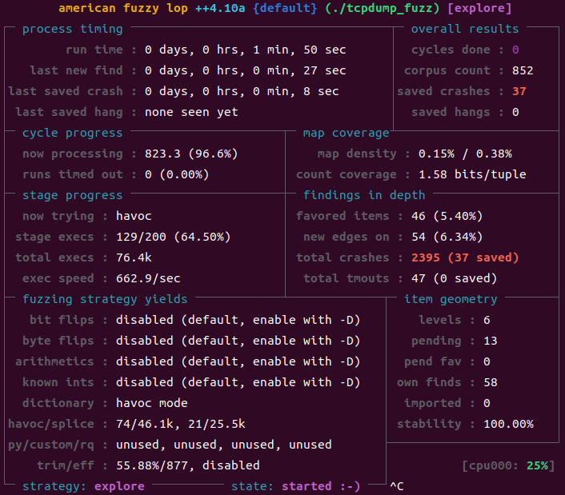

Fuzzing TCPdump-4.9.2 (From Fuzzing101 - Exercise3)
==============================================

TCPdump는 네트워크 패킷을 캡쳐해 분석하는 유명한 CLI(Command Line Interface) 소프트웨어이다. TCPdump 4.9.2 버전에 [CVE-2017-13028](https://knvd.krcert.or.kr/elkDetail.do?CVEID=CVE-2017-13028&jvn=&CVEID=CNNVD-201709-665&dilen=60c0729edd82393915a6af32) 취약점이 발견되었다. 퍼징을 통해 크래시를 분석하고 취약점을 보완해보자. 

## Download and build the target

* Download TCPdump-4.9.2
```bash
$ mkdir ~/project/fuzzing_tcpdump && cd ~/project/fuzzing_tcpdump
$ wget https://github.com/the-tcpdump-group/tcpdump/archive/refs/tags/tcpdump-4.9.2.tar.gz
$ tar -xvzf tcpdump-4.9.2.tar.gz
```
TCPdump는 패킷 캡쳐를 위한 라이브러리인 LibPcap을 사용한다. 따라서 LibPcap-1.8.0도 다운로드한다.

* Download LibPcap-1.8.0
```bash
$ wget https://github.com/the-tcpdump-group/libpcap/archive/refs/tags/libpcap-1.8.0.tar.gz
$ tar -xvzf libpcap-1.8.0.tar.gz
```
먼저 라이브러리인 LibPcap을 빌드해준다. 압축 해제한 디렉토리명이 libpcap-libpcap-1.8.0인 경우 libpcap-1.8.0으로 디렉토리명을 변경해줘야 정상적으로 링킹이 된다. 이번엔 AFL++에서 지원하는 ASAN 모드를 활용해 빌드했다. AFL_USE_ASAN 환경 변수를 조정함으로써 ASAN 모드를 사용할 수 있다.

* Build LibPcap-1.8.0 with afl-clang-lto and ASAN
```bash
$ cd libpcap-1.8.0
$ AFL_USE_ASAN=1 CC=afl-clang-lto ./configure --enable-shared=no --prefix="$HOME/project/fuzzing_tcpdump/install"
$ AFL_USE_ASAN=1 make
```
마찬가지로 TCPdump도 빌드해준다. 

* Build TCPdump-4.9.2 with afl-clang-lot and ASAN
```bash
$ cd ../tcpdump-4.9.2
$ AFL_USE_ASAN=1 CC=afl-clang-lto ./configure --prefix="$HOME/project/fuzzing_tcpdump/install"
$ AFL_USE_ASAN=1 make
$ AFL_USE_ASAN=1 make install
```

## Fuzzing
기본적으로 TCPdump는 테스트용 .pcap 파일을 tests 디렉토리에 제공해준다. 이를 이용해 퍼징해보자.
```bash
$ cd ~/project/fuzzing_tcpdump
$ afl-fuzz -m none -i ./tcpdump-4.9.2/tests/ -o ./output -s 123 -- ./tcpdump_fuzz -vvvvXX -ee -nn -r @@
```
tcpdump_fuzz는 install/sbin/tcpdump의 복사본이다. -m none 옵션은 AFL에서 가상 메모리 제한을 해제하는 옵션이다. tcpdump에 사용한 옵션을 간단하게 설명하면 다음과 같다.
1. -vvvvXX : vvvv는 매우 자세한 출력, XX는 패킷의 헤더와 페이로드를 모두 16진수와 ASCII로 출력
2. -ee : 링크 레벨 헤더 모두 출력
3. -nn : 호스트 이름과 서비스 이름을 해석하지 않고 숫자로만 출력
4. -r [file] : 패킷 캡쳐 파일인 .pcap 파일을 읽어 분석



1분 50초 가량 퍼징한 결과 37개의 saved crash가 발견되었다.  