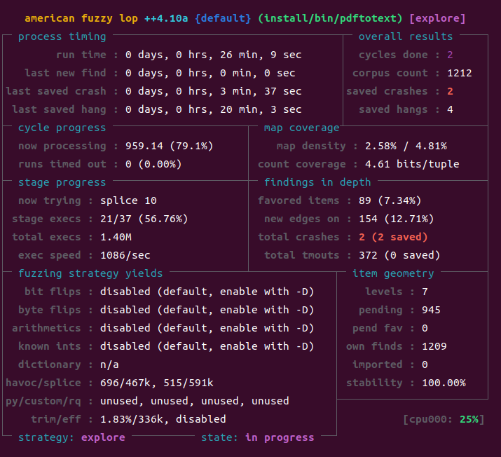

Fuzzing Xpdf-3.02 (From Fuzzing101 - Exercise1)
===============================================
퍼징에 더 익숙해지고, AFL++ 사용 실습을 위해 Antonio Morales의 [Fuzzing101 저장소](https://github.com/antonio-morales/Fuzzing101)의 실습 예제를 풀어보도록 한다. Exercise1은 Xpdf 3.02에 존재하는 [CVE-2019-13288](https://knvd.krcert.or.kr/elkDetail.do?CVEID=CVE-2019-13288&jvn=&CVEID=CNNVD-201907-278&dilen=60c193c2dd82393915b13ec6) 취약점을 퍼징을 통해 분석하고 PoC까지 진행하는 것이다. 

## Download and build Xpdf-3.02 with afl-clang-fast
```bash
~/project/fuzzing_xpdf$ wget https://dl.xpdfreader.com/old/xpdf-3.02.tar.gz
~/project/fuzzing_xpdf$ tar -xvzf xpdf-3.02.tar.gz && cd xpdf-3.02
~/project/fuzzing_xpdf$ CC=~/AFLplusplus/afl-clang-fast CXX=~/AFLplusplus/afl-clang-fast++ ./configure –-prefix="$HOME/project/fuzzing_xpdf/install"
~/project/fuzzing_xpdf$ make
~/project/fuzzing_xpdf$ make install
```
위와 같이 CC와 CXX 환경 변수를 각각 afl-clang-fast, afl-clang-fast++로 바꾸고 configure 스크립트를 실행 후 make하면 퍼징을 위한 instrument 코드가 삽입된 프로그램이 빌드된다. 총 5개의 실행파일이 생성되는데, 이 중 취약점이 존재하는 파일은 pdftotext이다. 초기 테스트케이스 준비를 위해 인터넷에서 3개의 간단한 pdf 파일 샘플을 가져왔다
```bash
~/project/fuzzing_xpdf/pdf_samples$ wget https://github.com/mozilla/pdf.js-sample-files/raw/master/helloworld.pdf
~/project/fuzzing_xpdf/pdf_samples$ wget http://www.africau.edu/images/default/sample.pdf
~/project/fuzzing_xpdf/pdf_samples$ wget
```

## Fuzzing Xpdf-3.02
모든 준비가 끝났으니 퍼징을 해보자.
```bash
~/project/fuzzing_xpdf$ afl-fuzz -i ./pdf_samples -o ./output -- ./install/bin/pdftotext @@ ./output
```
위에서 다운로드한 pdf_samples 디렉토리의 파일을 초기 테스트케이스로 정해 퍼징을 시작한다. pdftotext의 usage는 

    Usage: pdftotext [options] <PDF-file> [<text-file>]
이므로 @@(입력 파일) 뒤에 출력될 텍스트 파일의 위치를 ./output으로 잡아주었다. 



약 26분간 퍼징한 결과 2개의 saved crash가 발생했다. 여기서 saved crash는 AFL의 unique crash와 같은 개념이다. 
```
~/project/fuzzing_xpdf/output/default/crashes$ ls
README.txt
id:000000,sig:11,src:000000+000145,time:764817,execs:761380,op:splice,rep:8
id:000001,sig:11,src:001113,time:1352457,execs:1260033,op:havoc,rep:5
```
발생한 두 크래시는 sig 11로 Segmentation Fault가 발생한 크래시이다. 편의상 두 크래시의 이름을 각각 crash1, crash2로 변경한다.
```bash
~/project/fuzzing_xpdf/output/default/crashes$ mv id:000000,sig:11,src:000000+000145,time:764817,execs:761380,op:splice,rep:8 crash1
~/project/fuzzing_xpdf/output/default/crashes$ mv id:000001,sig:11,src:001113,time:1352457,execs:1260033,op:havoc,rep:5 crash1
```

## Reproduce Crashes
퍼징 결과로 얻은 2개의 크래시를 입력 파일로 사용해 Segmentation Fault가 발생하는지 확인해본다. 
* crash1
```bash
~/project/fuzzing_xpdf$ ./install/bin/pdftotext ./output/default/crashes/crash1 ./output
Error: PDF file is damaged - attempting to reconstruct xref table...
Segmentation fault(core dumped)
```
* crash2
```
~/project/fuzzing_xpdf$ ./install/bin/pdftotext ./output/default/crashes/crash2 ./output
Error: PDF file is damaged - attempting to reconstruct xref table...
Error (2992): Dictionary key must be a name object
Error (2994): Illegal character <c9> in hex string
Error (3026): Dictionary key must be a name object
Error (3060): Dictionary key must be a name object
... 중략(약 35만 개의 오류 메시지) ...
Error (3264): Dictionary key must be a name object
Error (3274): Dictionary key must be a name object
Error (2992): Dictionary key must be a name object
Segmentation fault(core dumped)
```
두 크래시 모두 Segmentation Fault를 발생하고 있다. Xpdf를 ASAN을 이용해 빌드한 후 크래시를 reproduce해 조금 더 자세히 살펴보자.
* Build Xpdf-3.02 with ASAN
```bash
~/project/fuzzing_xpdf$ rm -r install/ && cd xpdf-3.02/
~/project/fuzzing_xpdf/xpdf-3.02$ make clean
~/project/fuzzing_xpdf/xpdf-3.02$ CC="clang -fsanitize=address" > CXX="clang++ -fsanitize=address" ./configure --prefix="$HOME/project/fuzzing_xpdf/install"
~/project/fuzzing_xpdf/xpdf-3.02$ make
~/project/fuzzing_xpdf/xpdf-3.02$ make install
```
* Reproduce
```bash
~/project/fuzzing_xpdf$ ./install/bin/pdftotext ./output/default/crashes/crash1 ./output/
~/project/fuzzing_xpdf$ ./install/bin/pdftotext ./output/default/crashes/crash2 ./output/
```
<details>
 <summary> crash1 결과 </summary>
 Error: PDF file is damaged - attempting to reconstruct xref table...
 AddressSanitizer:DEADLYSIGNAL
 =================================================================
 ==24667==ERROR: AddressSanitizer: stack-overflow on address 0x7ffc5e46bff8 (pc 0x55fa8fb08033 bp 0x7ffc5e46c830 sp 0x7ffc5e46c000 T0)

    #0 0x55fa8fb08033 in __interceptor_free (/home/fuzz/project/fuzzing_xpdf/pdftotext_asan+0x168033) (BuildId: 8460859dac2e7602d21b96c20ce80bab686cf6ca)
    #1 0x7fa648a8d7d8 in _IO_free_backup_area libio/./libio/genops.c:190:3
    #2 0x7fa648a8aa63 in _IO_file_seekoff libio/./libio/fileops.c:975:3
    #3 0x7fa648a88cd2 in __fseeko64 libio/./libio/fseeko.c:40:12
    #4 0x55fa8fc7fbbd in FileStream::reset() /home/fuzz/project/fuzzing_xpdf/xpdf-3.02/xpdf/Stream.cc:602:3
    #5 0x55fa8fc608a5 in Object::streamReset() /home/fuzz/project/fuzzing_xpdf/xpdf-3.02/xpdf/./Object.h:280:13
    #6 0x55fa8fc608a5 in Lexer::Lexer(XRef*, Stream*) /home/fuzz/project/fuzzing_xpdf/xpdf-3.02/xpdf/Lexer.cc:57:10
    #7 0x55fa8fcd3219 in XRef::fetch(int, int, Object*) /home/fuzz/project/fuzzing_xpdf/xpdf-3.02/xpdf/XRef.cc:808:13
    #8 0x55fa8fc74960 in Object::dictLookup(char*, Object*) /home/fuzz/project/fuzzing_xpdf/xpdf-3.02/xpdf/./Object.h:253:18
    #9 0x55fa8fc74960 in Parser::makeStream(Object*, unsigned char*, CryptAlgorithm, int, int, int) /home/fuzz/project/fuzzing_xpdf/xpdf-3.02/xpdf/Parser.cc:156:9
    #10 0x55fa8fc73b51 in Parser::getObj(Object*, unsigned char*, CryptAlgorithm, int, int, int) /home/fuzz/project/fuzzing_xpdf/xpdf-3.02/xpdf/Parser.cc:94:18
    #11 0x55fa8fcd3651 in XRef::fetch(int, int, Object*) /home/fuzz/project/fuzzing_xpdf/xpdf-3.02/xpdf/XRef.cc:823:13
    #12 0x55fa8fc74960 in Object::dictLookup(char*, Object*) /home/fuzz/project/fuzzing_xpdf/xpdf-3.02/xpdf/./Object.h:253:18
    #13 0x55fa8fc74960 in Parser::makeStream(Object*, unsigned char*, CryptAlgorithm, int, int, int) /home/fuzz/project/fuzzing_xpdf/xpdf-3.02/xpdf/Parser.cc:156:9
    #14 0x55fa8fc73b51 in Parser::getObj(Object*, unsigned char*, CryptAlgorithm, int, int, int) /home/fuzz/project/fuzzing_xpdf/xpdf-3.02/xpdf/Parser.cc:94:18
    #15 0x55fa8fcd3651 in XRef::fetch(int, int, Object*) /home/fuzz/project/fuzzing_xpdf/xpdf-3.02/xpdf/XRef.cc:823:13
    #16 0x55fa8fc74960 in Object::dictLookup(char*, Object*) /home/fuzz/project/fuzzing_xpdf/xpdf-3.02/xpdf/./Object.h:253:18
    #17 0x55fa8fc74960 in Parser::makeStream(Object*, unsigned char*, CryptAlgorithm, int, int, int) /home/fuzz/project/fuzzing_xpdf/xpdf-3.02/xpdf/Parser.cc:156:9
    #18 0x55fa8fc73b51 in Parser::getObj(Object*, unsigned char*, CryptAlgorithm, int, int, int) /home/fuzz/project/fuzzing_xpdf/xpdf-3.02/xpdf/Parser.cc:94:18
    #19 0x55fa8fcd3651 in XRef::fetch(int, int, Object*) /home/fuzz/project/fuzzing_xpdf/xpdf-3.02/xpdf/XRef.cc:823:13
    #20 0x55fa8fc74960 in Object::dictLookup(char*, Object*) /home/fuzz/project/fuzzing_xpdf/xpdf-3.02/xpdf/./Object.h:253:18
    #21 0x55fa8fc74960 in Parser::makeStream(Object*, unsigned char*, CryptAlgorithm, int, int, int) /home/fuzz/project/fuzzing_xpdf/xpdf-3.02/xpdf/Parser.cc:156:9
    #22 0x55fa8fc73b51 in Parser::getObj(Object*, unsigned char*, CryptAlgorithm, int, int, int) /home/fuzz/project/fuzzing_xpdf/xpdf-3.02/xpdf/Parser.cc:94:18
    #23 0x55fa8fcd3651 in XRef::fetch(int, int, Object*) /home/fuzz/project/fuzzing_xpdf/xpdf-3.02/xpdf/XRef.cc:823:13
    #24 0x55fa8fc74960 in Object::dictLookup(char*, Object*) /home/fuzz/project/fuzzing_xpdf/xpdf-3.02/xpdf/./Object.h:253:18
    #25 0x55fa8fc74960 in Parser::makeStream(Object*, unsigned char*, CryptAlgorithm, int, int, int) /home/fuzz/project/fuzzing_xpdf/xpdf-3.02/xpdf/Parser.cc:156:9
    #26 0x55fa8fc73b51 in Parser::getObj(Object*, unsigned char*, CryptAlgorithm, int, int, int) /home/fuzz/project/fuzzing_xpdf/xpdf-3.02/xpdf/Parser.cc:94:18
    #27 0x55fa8fcd3651 in XRef::fetch(int, int, Object*) /home/fuzz/project/fuzzing_xpdf/xpdf-3.02/xpdf/XRef.cc:823:13
    #28 0x55fa8fc74960 in Object::dictLookup(char*, Object*) /home/fuzz/project/fuzzing_xpdf/xpdf-3.02/xpdf/./Object.h:253:18
    #29 0x55fa8fc74960 in Parser::makeStream(Object*, unsigned char*, CryptAlgorithm, int, int, int) /home/fuzz/project/fuzzing_xpdf/xpdf-3.02/xpdf/Parser.cc:156:9
    #30 0x55fa8fc73b51 in Parser::getObj(Object*, unsigned char*, CryptAlgorithm, int, int, int) /home/fuzz/project/fuzzing_xpdf/xpdf-3.02/xpdf/Parser.cc:94:18
    #31 0x55fa8fcd3651 in XRef::fetch(int, int, Object*) /home/fuzz/project/fuzzing_xpdf/xpdf-3.02/xpdf/XRef.cc:823:13
    #32 0x55fa8fc74960 in Object::dictLookup(char*, Object*) /home/fuzz/project/fuzzing_xpdf/xpdf-3.02/xpdf/./Object.h:253:18
    #33 0x55fa8fc74960 in Parser::makeStream(Object*, unsigned char*, CryptAlgorithm, int, int, int) /home/fuzz/project/fuzzing_xpdf/xpdf-3.02/xpdf/Parser.cc:156:9
    #34 0x55fa8fc73b51 in Parser::getObj(Object*, unsigned char*, CryptAlgorithm, int, int, int) /home/fuzz/project/fuzzing_xpdf/xpdf-3.02/xpdf/Parser.cc:94:18
    #35 0x55fa8fcd3651 in XRef::fetch(int, int, Object*) /home/fuzz/project/fuzzing_xpdf/xpdf-3.02/xpdf/XRef.cc:823:13
    #36 0x55fa8fc74960 in Object::dictLookup(char*, Object*) /home/fuzz/project/fuzzing_xpdf/xpdf-3.02/xpdf/./Object.h:253:18
    #37 0x55fa8fc74960 in Parser::makeStream(Object*, unsigned char*, CryptAlgorithm, int, int, int) /home/fuzz/project/fuzzing_xpdf/xpdf-3.02/xpdf/Parser.cc:156:9
    #38 0x55fa8fc73b51 in Parser::getObj(Object*, unsigned char*, CryptAlgorithm, int, int, int) /home/fuzz/project/fuzzing_xpdf/xpdf-3.02/xpdf/Parser.cc:94:18
    #39 0x55fa8fcd3651 in XRef::fetch(int, int, Object*) /home/fuzz/project/fuzzing_xpdf/xpdf-3.02/xpdf/XRef.cc:823:13
    #40 0x55fa8fc74960 in Object::dictLookup(char*, Object*) /home/fuzz/project/fuzzing_xpdf/xpdf-3.02/xpdf/./Object.h:253:18
    #41 0x55fa8fc74960 in Parser::makeStream(Object*, unsigned char*, CryptAlgorithm, int, int, int) /home/fuzz/project/fuzzing_xpdf/xpdf-3.02/xpdf/Parser.cc:156:9
    #42 0x55fa8fc73b51 in Parser::getObj(Object*, unsigned char*, CryptAlgorithm, int, int, int) /home/fuzz/project/fuzzing_xpdf/xpdf-3.02/xpdf/Parser.cc:94:18
    #43 0x55fa8fcd3651 in XRef::fetch(int, int, Object*) /home/fuzz/project/fuzzing_xpdf/xpdf-3.02/xpdf/XRef.cc:823:13
    #44 0x55fa8fc74960 in Object::dictLookup(char*, Object*) /home/fuzz/project/fuzzing_xpdf/xpdf-3.02/xpdf/./Object.h:253:18
    #45 0x55fa8fc74960 in Parser::makeStream(Object*, unsigned char*, CryptAlgorithm, int, int, int) /home/fuzz/project/fuzzing_xpdf/xpdf-3.02/xpdf/Parser.cc:156:9
    #46 0x55fa8fc73b51 in Parser::getObj(Object*, unsigned char*, CryptAlgorithm, int, int, int) /home/fuzz/project/fuzzing_xpdf/xpdf-3.02/xpdf/Parser.cc:94:18
    #47 0x55fa8fcd3651 in XRef::fetch(int, int, Object*) /home/fuzz/project/fuzzing_xpdf/xpdf-3.02/xpdf/XRef.cc:823:13
    #48 0x55fa8fc74960 in Object::dictLookup(char*, Object*) /home/fuzz/project/fuzzing_xpdf/xpdf-3.02/xpdf/./Object.h:253:18
    #49 0x55fa8fc74960 in Parser::makeStream(Object*, unsigned char*, CryptAlgorithm, int, int, int) /home/fuzz/project/fuzzing_xpdf/xpdf-3.02/xpdf/Parser.cc:156:9
    #50 0x55fa8fc73b51 in Parser::getObj(Object*, unsigned char*, CryptAlgorithm, int, int, int) /home/fuzz/project/fuzzing_xpdf/xpdf-3.02/xpdf/Parser.cc:94:18
    #51 0x55fa8fcd3651 in XRef::fetch(int, int, Object*) /home/fuzz/project/fuzzing_xpdf/xpdf-3.02/xpdf/XRef.cc:823:13
    #52 0x55fa8fc74960 in Object::dictLookup(char*, Object*) /home/fuzz/project/fuzzing_xpdf/xpdf-3.02/xpdf/./Object.h:253:18
    #53 0x55fa8fc74960 in Parser::makeStream(Object*, unsigned char*, CryptAlgorithm, int, int, int) /home/fuzz/project/fuzzing_xpdf/xpdf-3.02/xpdf/Parser.cc:156:9
    #54 0x55fa8fc73b51 in Parser::getObj(Object*, unsigned char*, CryptAlgorithm, int, int, int) /home/fuzz/project/fuzzing_xpdf/xpdf-3.02/xpdf/Parser.cc:94:18
    #55 0x55fa8fcd3651 in XRef::fetch(int, int, Object*) /home/fuzz/project/fuzzing_xpdf/xpdf-3.02/xpdf/XRef.cc:823:13
    #56 0x55fa8fc74960 in Object::dictLookup(char*, Object*) /home/fuzz/project/fuzzing_xpdf/xpdf-3.02/xpdf/./Object.h:253:18
    #57 0x55fa8fc74960 in Parser::makeStream(Object*, unsigned char*, CryptAlgorithm, int, int, int) /home/fuzz/project/fuzzing_xpdf/xpdf-3.02/xpdf/Parser.cc:156:9
    #58 0x55fa8fc73b51 in Parser::getObj(Object*, unsigned char*, CryptAlgorithm, int, int, int) /home/fuzz/project/fuzzing_xpdf/xpdf-3.02/xpdf/Parser.cc:94:18
    #59 0x55fa8fcd3651 in XRef::fetch(int, int, Object*) /home/fuzz/project/fuzzing_xpdf/xpdf-3.02/xpdf/XRef.cc:823:13
    #60 0x55fa8fc74960 in Object::dictLookup(char*, Object*) /home/fuzz/project/fuzzing_xpdf/xpdf-3.02/xpdf/./Object.h:253:18
    #61 0x55fa8fc74960 in Parser::makeStream(Object*, unsigned char*, CryptAlgorithm, int, int, int) /home/fuzz/project/fuzzing_xpdf/xpdf-3.02/xpdf/Parser.cc:156:9
    #62 0x55fa8fc73b51 in Parser::getObj(Object*, unsigned char*, CryptAlgorithm, int, int, int) /home/fuzz/project/fuzzing_xpdf/xpdf-3.02/xpdf/Parser.cc:94:18
    #63 0x55fa8fcd3651 in XRef::fetch(int, int, Object*) /home/fuzz/project/fuzzing_xpdf/xpdf-3.02/xpdf/XRef.cc:823:13
    #64 0x55fa8fc74960 in Object::dictLookup(char*, Object*) /home/fuzz/project/fuzzing_xpdf/xpdf-3.02/xpdf/./Object.h:253:18
    #65 0x55fa8fc74960 in Parser::makeStream(Object*, unsigned char*, CryptAlgorithm, int, int, int) /home/fuzz/project/fuzzing_xpdf/xpdf-3.02/xpdf/Parser.cc:156:9
    #66 0x55fa8fc73b51 in Parser::getObj(Object*, unsigned char*, CryptAlgorithm, int, int, int) /home/fuzz/project/fuzzing_xpdf/xpdf-3.02/xpdf/Parser.cc:94:18
    #67 0x55fa8fcd3651 in XRef::fetch(int, int, Object*) /home/fuzz/project/fuzzing_xpdf/xpdf-3.02/xpdf/XRef.cc:823:13
    #68 0x55fa8fc74960 in Object::dictLookup(char*, Object*) /home/fuzz/project/fuzzing_xpdf/xpdf-3.02/xpdf/./Object.h:253:18
    #69 0x55fa8fc74960 in Parser::makeStream(Object*, unsigned char*, CryptAlgorithm, int, int, int) /home/fuzz/project/fuzzing_xpdf/xpdf-3.02/xpdf/Parser.cc:156:9
    #70 0x55fa8fc73b51 in Parser::getObj(Object*, unsigned char*, CryptAlgorithm, int, int, int) /home/fuzz/project/fuzzing_xpdf/xpdf-3.02/xpdf/Parser.cc:94:18
    #71 0x55fa8fcd3651 in XRef::fetch(int, int, Object*) /home/fuzz/project/fuzzing_xpdf/xpdf-3.02/xpdf/XRef.cc:823:13
    #72 0x55fa8fc74960 in Object::dictLookup(char*, Object*) /home/fuzz/project/fuzzing_xpdf/xpdf-3.02/xpdf/./Object.h:253:18
    #73 0x55fa8fc74960 in Parser::makeStream(Object*, unsigned char*, CryptAlgorithm, int, int, int) /home/fuzz/project/fuzzing_xpdf/xpdf-3.02/xpdf/Parser.cc:156:9
    #74 0x55fa8fc73b51 in Parser::getObj(Object*, unsigned char*, CryptAlgorithm, int, int, int) /home/fuzz/project/fuzzing_xpdf/xpdf-3.02/xpdf/Parser.cc:94:18
    #75 0x55fa8fcd3651 in XRef::fetch(int, int, Object*) /home/fuzz/project/fuzzing_xpdf/xpdf-3.02/xpdf/XRef.cc:823:13
    #76 0x55fa8fc74960 in Object::dictLookup(char*, Object*) /home/fuzz/project/fuzzing_xpdf/xpdf-3.02/xpdf/./Object.h:253:18
    #77 0x55fa8fc74960 in Parser::makeStream(Object*, unsigned char*, CryptAlgorithm, int, int, int) /home/fuzz/project/fuzzing_xpdf/xpdf-3.02/xpdf/Parser.cc:156:9
    #78 0x55fa8fc73b51 in Parser::getObj(Object*, unsigned char*, CryptAlgorithm, int, int, int) /home/fuzz/project/fuzzing_xpdf/xpdf-3.02/xpdf/Parser.cc:94:18
    #79 0x55fa8fcd3651 in XRef::fetch(int, int, Object*) /home/fuzz/project/fuzzing_xpdf/xpdf-3.02/xpdf/XRef.cc:823:13
    #80 0x55fa8fc74960 in Object::dictLookup(char*, Object*) /home/fuzz/project/fuzzing_xpdf/xpdf-3.02/xpdf/./Object.h:253:18
    #81 0x55fa8fc74960 in Parser::makeStream(Object*, unsigned char*, CryptAlgorithm, int, int, int) /home/fuzz/project/fuzzing_xpdf/xpdf-3.02/xpdf/Parser.cc:156:9
    #82 0x55fa8fc73b51 in Parser::getObj(Object*, unsigned char*, CryptAlgorithm, int, int, int) /home/fuzz/project/fuzzing_xpdf/xpdf-3.02/xpdf/Parser.cc:94:18
    #83 0x55fa8fcd3651 in XRef::fetch(int, int, Object*) /home/fuzz/project/fuzzing_xpdf/xpdf-3.02/xpdf/XRef.cc:823:13
    #84 0x55fa8fc74960 in Object::dictLookup(char*, Object*) /home/fuzz/project/fuzzing_xpdf/xpdf-3.02/xpdf/./Object.h:253:18
    #85 0x55fa8fc74960 in Parser::makeStream(Object*, unsigned char*, CryptAlgorithm, int, int, int) /home/fuzz/project/fuzzing_xpdf/xpdf-3.02/xpdf/Parser.cc:156:9
    #86 0x55fa8fc73b51 in Parser::getObj(Object*, unsigned char*, CryptAlgorithm, int, int, int) /home/fuzz/project/fuzzing_xpdf/xpdf-3.02/xpdf/Parser.cc:94:18
    #87 0x55fa8fcd3651 in XRef::fetch(int, int, Object*) /home/fuzz/project/fuzzing_xpdf/xpdf-3.02/xpdf/XRef.cc:823:13
    #88 0x55fa8fc74960 in Object::dictLookup(char*, Object*) /home/fuzz/project/fuzzing_xpdf/xpdf-3.02/xpdf/./Object.h:253:18
    #89 0x55fa8fc74960 in Parser::makeStream(Object*, unsigned char*, CryptAlgorithm, int, int, int) /home/fuzz/project/fuzzing_xpdf/xpdf-3.02/xpdf/Parser.cc:156:9
    #90 0x55fa8fc73b51 in Parser::getObj(Object*, unsigned char*, CryptAlgorithm, int, int, int) /home/fuzz/project/fuzzing_xpdf/xpdf-3.02/xpdf/Parser.cc:94:18
    #91 0x55fa8fcd3651 in XRef::fetch(int, int, Object*) /home/fuzz/project/fuzzing_xpdf/xpdf-3.02/xpdf/XRef.cc:823:13
    #92 0x55fa8fc74960 in Object::dictLookup(char*, Object*) /home/fuzz/project/fuzzing_xpdf/xpdf-3.02/xpdf/./Object.h:253:18
    #93 0x55fa8fc74960 in Parser::makeStream(Object*, unsigned char*, CryptAlgorithm, int, int, int) /home/fuzz/project/fuzzing_xpdf/xpdf-3.02/xpdf/Parser.cc:156:9
    #94 0x55fa8fc73b51 in Parser::getObj(Object*, unsigned char*, CryptAlgorithm, int, int, int) /home/fuzz/project/fuzzing_xpdf/xpdf-3.02/xpdf/Parser.cc:94:18
    #95 0x55fa8fcd3651 in XRef::fetch(int, int, Object*) /home/fuzz/project/fuzzing_xpdf/xpdf-3.02/xpdf/XRef.cc:823:13
    #96 0x55fa8fc74960 in Object::dictLookup(char*, Object*) /home/fuzz/project/fuzzing_xpdf/xpdf-3.02/xpdf/./Object.h:253:18
    #97 0x55fa8fc74960 in Parser::makeStream(Object*, unsigned char*, CryptAlgorithm, int, int, int) /home/fuzz/project/fuzzing_xpdf/xpdf-3.02/xpdf/Parser.cc:156:9
    #98 0x55fa8fc73b51 in Parser::getObj(Object*, unsigned char*, CryptAlgorithm, int, int, int) /home/fuzz/project/fuzzing_xpdf/xpdf-3.02/xpdf/Parser.cc:94:18
    #99 0x55fa8fcd3651 in XRef::fetch(int, int, Object*) /home/fuzz/project/fuzzing_xpdf/xpdf-3.02/xpdf/XRef.cc:823:13
    #100 0x55fa8fc74960 in Object::dictLookup(char*, Object*) /home/fuzz/project/fuzzing_xpdf/xpdf-3.02/xpdf/./Object.h:253:18
    #101 0x55fa8fc74960 in Parser::makeStream(Object*, unsigned char*, CryptAlgorithm, int, int, int) /home/fuzz/project/fuzzing_xpdf/xpdf-3.02/xpdf/Parser.cc:156:9
    #102 0x55fa8fc73b51 in Parser::getObj(Object*, unsigned char*, CryptAlgorithm, int, int, int) /home/fuzz/project/fuzzing_xpdf/xpdf-3.02/xpdf/Parser.cc:94:18
    #103 0x55fa8fcd3651 in XRef::fetch(int, int, Object*) /home/fuzz/project/fuzzing_xpdf/xpdf-3.02/xpdf/XRef.cc:823:13
    #104 0x55fa8fc74960 in Object::dictLookup(char*, Object*) /home/fuzz/project/fuzzing_xpdf/xpdf-3.02/xpdf/./Object.h:253:18
    #105 0x55fa8fc74960 in Parser::makeStream(Object*, unsigned char*, CryptAlgorithm, int, int, int) /home/fuzz/project/fuzzing_xpdf/xpdf-3.02/xpdf/Parser.cc:156:9
    #106 0x55fa8fc73b51 in Parser::getObj(Object*, unsigned char*, CryptAlgorithm, int, int, int) /home/fuzz/project/fuzzing_xpdf/xpdf-3.02/xpdf/Parser.cc:94:18
    #107 0x55fa8fcd3651 in XRef::fetch(int, int, Object*) /home/fuzz/project/fuzzing_xpdf/xpdf-3.02/xpdf/XRef.cc:823:13
    #108 0x55fa8fc74960 in Object::dictLookup(char*, Object*) /home/fuzz/project/fuzzing_xpdf/xpdf-3.02/xpdf/./Object.h:253:18
    #109 0x55fa8fc74960 in Parser::makeStream(Object*, unsigned char*, CryptAlgorithm, int, int, int) /home/fuzz/project/fuzzing_xpdf/xpdf-3.02/xpdf/Parser.cc:156:9
    #110 0x55fa8fc73b51 in Parser::getObj(Object*, unsigned char*, CryptAlgorithm, int, int, int) /home/fuzz/project/fuzzing_xpdf/xpdf-3.02/xpdf/Parser.cc:94:18
    #111 0x55fa8fcd3651 in XRef::fetch(int, int, Object*) /home/fuzz/project/fuzzing_xpdf/xpdf-3.02/xpdf/XRef.cc:823:13
    #112 0x55fa8fc74960 in Object::dictLookup(char*, Object*) /home/fuzz/project/fuzzing_xpdf/xpdf-3.02/xpdf/./Object.h:253:18
    #113 0x55fa8fc74960 in Parser::makeStream(Object*, unsigned char*, CryptAlgorithm, int, int, int) /home/fuzz/project/fuzzing_xpdf/xpdf-3.02/xpdf/Parser.cc:156:9
    #114 0x55fa8fc73b51 in Parser::getObj(Object*, unsigned char*, CryptAlgorithm, int, int, int) /home/fuzz/project/fuzzing_xpdf/xpdf-3.02/xpdf/Parser.cc:94:18
    #115 0x55fa8fcd3651 in XRef::fetch(int, int, Object*) /home/fuzz/project/fuzzing_xpdf/xpdf-3.02/xpdf/XRef.cc:823:13
    #116 0x55fa8fc74960 in Object::dictLookup(char*, Object*) /home/fuzz/project/fuzzing_xpdf/xpdf-3.02/xpdf/./Object.h:253:18
    #117 0x55fa8fc74960 in Parser::makeStream(Object*, unsigned char*, CryptAlgorithm, int, int, int) /home/fuzz/project/fuzzing_xpdf/xpdf-3.02/xpdf/Parser.cc:156:9
    #118 0x55fa8fc73b51 in Parser::getObj(Object*, unsigned char*, CryptAlgorithm, int, int, int) /home/fuzz/project/fuzzing_xpdf/xpdf-3.02/xpdf/Parser.cc:94:18
    #119 0x55fa8fcd3651 in XRef::fetch(int, int, Object*) /home/fuzz/project/fuzzing_xpdf/xpdf-3.02/xpdf/XRef.cc:823:13
    #120 0x55fa8fc74960 in Object::dictLookup(char*, Object*) /home/fuzz/project/fuzzing_xpdf/xpdf-3.02/xpdf/./Object.h:253:18
    #121 0x55fa8fc74960 in Parser::makeStream(Object*, unsigned char*, CryptAlgorithm, int, int, int) /home/fuzz/project/fuzzing_xpdf/xpdf-3.02/xpdf/Parser.cc:156:9
    #122 0x55fa8fc73b51 in Parser::getObj(Object*, unsigned char*, CryptAlgorithm, int, int, int) /home/fuzz/project/fuzzing_xpdf/xpdf-3.02/xpdf/Parser.cc:94:18
    #123 0x55fa8fcd3651 in XRef::fetch(int, int, Object*) /home/fuzz/project/fuzzing_xpdf/xpdf-3.02/xpdf/XRef.cc:823:13
    #124 0x55fa8fc74960 in Object::dictLookup(char*, Object*) /home/fuzz/project/fuzzing_xpdf/xpdf-3.02/xpdf/./Object.h:253:18
    #125 0x55fa8fc74960 in Parser::makeStream(Object*, unsigned char*, CryptAlgorithm, int, int, int) /home/fuzz/project/fuzzing_xpdf/xpdf-3.02/xpdf/Parser.cc:156:9
    #126 0x55fa8fc73b51 in Parser::getObj(Object*, unsigned char*, CryptAlgorithm, int, int, int) /home/fuzz/project/fuzzing_xpdf/xpdf-3.02/xpdf/Parser.cc:94:18
    #127 0x55fa8fcd3651 in XRef::fetch(int, int, Object*) /home/fuzz/project/fuzzing_xpdf/xpdf-3.02/xpdf/XRef.cc:823:13
    #128 0x55fa8fc74960 in Object::dictLookup(char*, Object*) /home/fuzz/project/fuzzing_xpdf/xpdf-3.02/xpdf/./Object.h:253:18
    #129 0x55fa8fc74960 in Parser::makeStream(Object*, unsigned char*, CryptAlgorithm, int, int, int) /home/fuzz/project/fuzzing_xpdf/xpdf-3.02/xpdf/Parser.cc:156:9
    #130 0x55fa8fc73b51 in Parser::getObj(Object*, unsigned char*, CryptAlgorithm, int, int, int) /home/fuzz/project/fuzzing_xpdf/xpdf-3.02/xpdf/Parser.cc:94:18
    #131 0x55fa8fcd3651 in XRef::fetch(int, int, Object*) /home/fuzz/project/fuzzing_xpdf/xpdf-3.02/xpdf/XRef.cc:823:13
    #132 0x55fa8fc74960 in Object::dictLookup(char*, Object*) /home/fuzz/project/fuzzing_xpdf/xpdf-3.02/xpdf/./Object.h:253:18
    #133 0x55fa8fc74960 in Parser::makeStream(Object*, unsigned char*, CryptAlgorithm, int, int, int) /home/fuzz/project/fuzzing_xpdf/xpdf-3.02/xpdf/Parser.cc:156:9
    #134 0x55fa8fc73b51 in Parser::getObj(Object*, unsigned char*, CryptAlgorithm, int, int, int) /home/fuzz/project/fuzzing_xpdf/xpdf-3.02/xpdf/Parser.cc:94:18
    #135 0x55fa8fcd3651 in XRef::fetch(int, int, Object*) /home/fuzz/project/fuzzing_xpdf/xpdf-3.02/xpdf/XRef.cc:823:13
    #136 0x55fa8fc74960 in Object::dictLookup(char*, Object*) /home/fuzz/project/fuzzing_xpdf/xpdf-3.02/xpdf/./Object.h:253:18
    #137 0x55fa8fc74960 in Parser::makeStream(Object*, unsigned char*, CryptAlgorithm, int, int, int) /home/fuzz/project/fuzzing_xpdf/xpdf-3.02/xpdf/Parser.cc:156:9
    #138 0x55fa8fc73b51 in Parser::getObj(Object*, unsigned char*, CryptAlgorithm, int, int, int) /home/fuzz/project/fuzzing_xpdf/xpdf-3.02/xpdf/Parser.cc:94:18
    #139 0x55fa8fcd3651 in XRef::fetch(int, int, Object*) /home/fuzz/project/fuzzing_xpdf/xpdf-3.02/xpdf/XRef.cc:823:13
    #140 0x55fa8fc74960 in Object::dictLookup(char*, Object*) /home/fuzz/project/fuzzing_xpdf/xpdf-3.02/xpdf/./Object.h:253:18
    #141 0x55fa8fc74960 in Parser::makeStream(Object*, unsigned char*, CryptAlgorithm, int, int, int) /home/fuzz/project/fuzzing_xpdf/xpdf-3.02/xpdf/Parser.cc:156:9
    #142 0x55fa8fc73b51 in Parser::getObj(Object*, unsigned char*, CryptAlgorithm, int, int, int) /home/fuzz/project/fuzzing_xpdf/xpdf-3.02/xpdf/Parser.cc:94:18
    #143 0x55fa8fcd3651 in XRef::fetch(int, int, Object*) /home/fuzz/project/fuzzing_xpdf/xpdf-3.02/xpdf/XRef.cc:823:13
    #144 0x55fa8fc74960 in Object::dictLookup(char*, Object*) /home/fuzz/project/fuzzing_xpdf/xpdf-3.02/xpdf/./Object.h:253:18
    #145 0x55fa8fc74960 in Parser::makeStream(Object*, unsigned char*, CryptAlgorithm, int, int, int) /home/fuzz/project/fuzzing_xpdf/xpdf-3.02/xpdf/Parser.cc:156:9
    #146 0x55fa8fc73b51 in Parser::getObj(Object*, unsigned char*, CryptAlgorithm, int, int, int) /home/fuzz/project/fuzzing_xpdf/xpdf-3.02/xpdf/Parser.cc:94:18
    #147 0x55fa8fcd3651 in XRef::fetch(int, int, Object*) /home/fuzz/project/fuzzing_xpdf/xpdf-3.02/xpdf/XRef.cc:823:13
    #148 0x55fa8fc74960 in Object::dictLookup(char*, Object*) /home/fuzz/project/fuzzing_xpdf/xpdf-3.02/xpdf/./Object.h:253:18
    #149 0x55fa8fc74960 in Parser::makeStream(Object*, unsigned char*, CryptAlgorithm, int, int, int) /home/fuzz/project/fuzzing_xpdf/xpdf-3.02/xpdf/Parser.cc:156:9
    #150 0x55fa8fc73b51 in Parser::getObj(Object*, unsigned char*, CryptAlgorithm, int, int, int) /home/fuzz/project/fuzzing_xpdf/xpdf-3.02/xpdf/Parser.cc:94:18
    #151 0x55fa8fcd3651 in XRef::fetch(int, int, Object*) /home/fuzz/project/fuzzing_xpdf/xpdf-3.02/xpdf/XRef.cc:823:13
    #152 0x55fa8fc74960 in Object::dictLookup(char*, Object*) /home/fuzz/project/fuzzing_xpdf/xpdf-3.02/xpdf/./Object.h:253:18
    #153 0x55fa8fc74960 in Parser::makeStream(Object*, unsigned char*, CryptAlgorithm, int, int, int) /home/fuzz/project/fuzzing_xpdf/xpdf-3.02/xpdf/Parser.cc:156:9
    #154 0x55fa8fc73b51 in Parser::getObj(Object*, unsigned char*, CryptAlgorithm, int, int, int) /home/fuzz/project/fuzzing_xpdf/xpdf-3.02/xpdf/Parser.cc:94:18
    #155 0x55fa8fcd3651 in XRef::fetch(int, int, Object*) /home/fuzz/project/fuzzing_xpdf/xpdf-3.02/xpdf/XRef.cc:823:13
    #156 0x55fa8fc74960 in Object::dictLookup(char*, Object*) /home/fuzz/project/fuzzing_xpdf/xpdf-3.02/xpdf/./Object.h:253:18
    #157 0x55fa8fc74960 in Parser::makeStream(Object*, unsigned char*, CryptAlgorithm, int, int, int) /home/fuzz/project/fuzzing_xpdf/xpdf-3.02/xpdf/Parser.cc:156:9
    #158 0x55fa8fc73b51 in Parser::getObj(Object*, unsigned char*, CryptAlgorithm, int, int, int) /home/fuzz/project/fuzzing_xpdf/xpdf-3.02/xpdf/Parser.cc:94:18
    #159 0x55fa8fcd3651 in XRef::fetch(int, int, Object*) /home/fuzz/project/fuzzing_xpdf/xpdf-3.02/xpdf/XRef.cc:823:13
    #160 0x55fa8fc74960 in Object::dictLookup(char*, Object*) /home/fuzz/project/fuzzing_xpdf/xpdf-3.02/xpdf/./Object.h:253:18
    #161 0x55fa8fc74960 in Parser::makeStream(Object*, unsigned char*, CryptAlgorithm, int, int, int) /home/fuzz/project/fuzzing_xpdf/xpdf-3.02/xpdf/Parser.cc:156:9
    #162 0x55fa8fc73b51 in Parser::getObj(Object*, unsigned char*, CryptAlgorithm, int, int, int) /home/fuzz/project/fuzzing_xpdf/xpdf-3.02/xpdf/Parser.cc:94:18
    #163 0x55fa8fcd3651 in XRef::fetch(int, int, Object*) /home/fuzz/project/fuzzing_xpdf/xpdf-3.02/xpdf/XRef.cc:823:13
    #164 0x55fa8fc74960 in Object::dictLookup(char*, Object*) /home/fuzz/project/fuzzing_xpdf/xpdf-3.02/xpdf/./Object.h:253:18
    #165 0x55fa8fc74960 in Parser::makeStream(Object*, unsigned char*, CryptAlgorithm, int, int, int) /home/fuzz/project/fuzzing_xpdf/xpdf-3.02/xpdf/Parser.cc:156:9
    #166 0x55fa8fc73b51 in Parser::getObj(Object*, unsigned char*, CryptAlgorithm, int, int, int) /home/fuzz/project/fuzzing_xpdf/xpdf-3.02/xpdf/Parser.cc:94:18
    #167 0x55fa8fcd3651 in XRef::fetch(int, int, Object*) /home/fuzz/project/fuzzing_xpdf/xpdf-3.02/xpdf/XRef.cc:823:13
    #168 0x55fa8fc74960 in Object::dictLookup(char*, Object*) /home/fuzz/project/fuzzing_xpdf/xpdf-3.02/xpdf/./Object.h:253:18
    #169 0x55fa8fc74960 in Parser::makeStream(Object*, unsigned char*, CryptAlgorithm, int, int, int) /home/fuzz/project/fuzzing_xpdf/xpdf-3.02/xpdf/Parser.cc:156:9
    #170 0x55fa8fc73b51 in Parser::getObj(Object*, unsigned char*, CryptAlgorithm, int, int, int) /home/fuzz/project/fuzzing_xpdf/xpdf-3.02/xpdf/Parser.cc:94:18
    #171 0x55fa8fcd3651 in XRef::fetch(int, int, Object*) /home/fuzz/project/fuzzing_xpdf/xpdf-3.02/xpdf/XRef.cc:823:13
    #172 0x55fa8fc74960 in Object::dictLookup(char*, Object*) /home/fuzz/project/fuzzing_xpdf/xpdf-3.02/xpdf/./Object.h:253:18
    #173 0x55fa8fc74960 in Parser::makeStream(Object*, unsigned char*, CryptAlgorithm, int, int, int) /home/fuzz/project/fuzzing_xpdf/xpdf-3.02/xpdf/Parser.cc:156:9
    #174 0x55fa8fc73b51 in Parser::getObj(Object*, unsigned char*, CryptAlgorithm, int, int, int) /home/fuzz/project/fuzzing_xpdf/xpdf-3.02/xpdf/Parser.cc:94:18
    #175 0x55fa8fcd3651 in XRef::fetch(int, int, Object*) /home/fuzz/project/fuzzing_xpdf/xpdf-3.02/xpdf/XRef.cc:823:13
    #176 0x55fa8fc74960 in Object::dictLookup(char*, Object*) /home/fuzz/project/fuzzing_xpdf/xpdf-3.02/xpdf/./Object.h:253:18
    #177 0x55fa8fc74960 in Parser::makeStream(Object*, unsigned char*, CryptAlgorithm, int, int, int) /home/fuzz/project/fuzzing_xpdf/xpdf-3.02/xpdf/Parser.cc:156:9
    #178 0x55fa8fc73b51 in Parser::getObj(Object*, unsigned char*, CryptAlgorithm, int, int, int) /home/fuzz/project/fuzzing_xpdf/xpdf-3.02/xpdf/Parser.cc:94:18
    #179 0x55fa8fcd3651 in XRef::fetch(int, int, Object*) /home/fuzz/project/fuzzing_xpdf/xpdf-3.02/xpdf/XRef.cc:823:13
    #180 0x55fa8fc74960 in Object::dictLookup(char*, Object*) /home/fuzz/project/fuzzing_xpdf/xpdf-3.02/xpdf/./Object.h:253:18
    #181 0x55fa8fc74960 in Parser::makeStream(Object*, unsigned char*, CryptAlgorithm, int, int, int) /home/fuzz/project/fuzzing_xpdf/xpdf-3.02/xpdf/Parser.cc:156:9
    #182 0x55fa8fc73b51 in Parser::getObj(Object*, unsigned char*, CryptAlgorithm, int, int, int) /home/fuzz/project/fuzzing_xpdf/xpdf-3.02/xpdf/Parser.cc:94:18
    #183 0x55fa8fcd3651 in XRef::fetch(int, int, Object*) /home/fuzz/project/fuzzing_xpdf/xpdf-3.02/xpdf/XRef.cc:823:13
    #184 0x55fa8fc74960 in Object::dictLookup(char*, Object*) /home/fuzz/project/fuzzing_xpdf/xpdf-3.02/xpdf/./Object.h:253:18
    #185 0x55fa8fc74960 in Parser::makeStream(Object*, unsigned char*, CryptAlgorithm, int, int, int) /home/fuzz/project/fuzzing_xpdf/xpdf-3.02/xpdf/Parser.cc:156:9
    #186 0x55fa8fc73b51 in Parser::getObj(Object*, unsigned char*, CryptAlgorithm, int, int, int) /home/fuzz/project/fuzzing_xpdf/xpdf-3.02/xpdf/Parser.cc:94:18
    #187 0x55fa8fcd3651 in XRef::fetch(int, int, Object*) /home/fuzz/project/fuzzing_xpdf/xpdf-3.02/xpdf/XRef.cc:823:13
    #188 0x55fa8fc74960 in Object::dictLookup(char*, Object*) /home/fuzz/project/fuzzing_xpdf/xpdf-3.02/xpdf/./Object.h:253:18
    #189 0x55fa8fc74960 in Parser::makeStream(Object*, unsigned char*, CryptAlgorithm, int, int, int) /home/fuzz/project/fuzzing_xpdf/xpdf-3.02/xpdf/Parser.cc:156:9
    #190 0x55fa8fc73b51 in Parser::getObj(Object*, unsigned char*, CryptAlgorithm, int, int, int) /home/fuzz/project/fuzzing_xpdf/xpdf-3.02/xpdf/Parser.cc:94:18
    #191 0x55fa8fcd3651 in XRef::fetch(int, int, Object*) /home/fuzz/project/fuzzing_xpdf/xpdf-3.02/xpdf/XRef.cc:823:13
    #192 0x55fa8fc74960 in Object::dictLookup(char*, Object*) /home/fuzz/project/fuzzing_xpdf/xpdf-3.02/xpdf/./Object.h:253:18
    #193 0x55fa8fc74960 in Parser::makeStream(Object*, unsigned char*, CryptAlgorithm, int, int, int) /home/fuzz/project/fuzzing_xpdf/xpdf-3.02/xpdf/Parser.cc:156:9
    #194 0x55fa8fc73b51 in Parser::getObj(Object*, unsigned char*, CryptAlgorithm, int, int, int) /home/fuzz/project/fuzzing_xpdf/xpdf-3.02/xpdf/Parser.cc:94:18
    #195 0x55fa8fcd3651 in XRef::fetch(int, int, Object*) /home/fuzz/project/fuzzing_xpdf/xpdf-3.02/xpdf/XRef.cc:823:13
    #196 0x55fa8fc74960 in Object::dictLookup(char*, Object*) /home/fuzz/project/fuzzing_xpdf/xpdf-3.02/xpdf/./Object.h:253:18
    #197 0x55fa8fc74960 in Parser::makeStream(Object*, unsigned char*, CryptAlgorithm, int, int, int) /home/fuzz/project/fuzzing_xpdf/xpdf-3.02/xpdf/Parser.cc:156:9
    #198 0x55fa8fc73b51 in Parser::getObj(Object*, unsigned char*, CryptAlgorithm, int, int, int) /home/fuzz/project/fuzzing_xpdf/xpdf-3.02/xpdf/Parser.cc:94:18
    #199 0x55fa8fcd3651 in XRef::fetch(int, int, Object*) /home/fuzz/project/fuzzing_xpdf/xpdf-3.02/xpdf/XRef.cc:823:13
    #200 0x55fa8fc74960 in Object::dictLookup(char*, Object*) /home/fuzz/project/fuzzing_xpdf/xpdf-3.02/xpdf/./Object.h:253:18
    #201 0x55fa8fc74960 in Parser::makeStream(Object*, unsigned char*, CryptAlgorithm, int, int, int) /home/fuzz/project/fuzzing_xpdf/xpdf-3.02/xpdf/Parser.cc:156:9
    #202 0x55fa8fc73b51 in Parser::getObj(Object*, unsigned char*, CryptAlgorithm, int, int, int) /home/fuzz/project/fuzzing_xpdf/xpdf-3.02/xpdf/Parser.cc:94:18
    #203 0x55fa8fcd3651 in XRef::fetch(int, int, Object*) /home/fuzz/project/fuzzing_xpdf/xpdf-3.02/xpdf/XRef.cc:823:13
    #204 0x55fa8fc74960 in Object::dictLookup(char*, Object*) /home/fuzz/project/fuzzing_xpdf/xpdf-3.02/xpdf/./Object.h:253:18
    #205 0x55fa8fc74960 in Parser::makeStream(Object*, unsigned char*, CryptAlgorithm, int, int, int) /home/fuzz/project/fuzzing_xpdf/xpdf-3.02/xpdf/Parser.cc:156:9
    #206 0x55fa8fc73b51 in Parser::getObj(Object*, unsigned char*, CryptAlgorithm, int, int, int) /home/fuzz/project/fuzzing_xpdf/xpdf-3.02/xpdf/Parser.cc:94:18
    #207 0x55fa8fcd3651 in XRef::fetch(int, int, Object*) /home/fuzz/project/fuzzing_xpdf/xpdf-3.02/xpdf/XRef.cc:823:13
    #208 0x55fa8fc74960 in Object::dictLookup(char*, Object*) /home/fuzz/project/fuzzing_xpdf/xpdf-3.02/xpdf/./Object.h:253:18
    #209 0x55fa8fc74960 in Parser::makeStream(Object*, unsigned char*, CryptAlgorithm, int, int, int) /home/fuzz/project/fuzzing_xpdf/xpdf-3.02/xpdf/Parser.cc:156:9
    #210 0x55fa8fc73b51 in Parser::getObj(Object*, unsigned char*, CryptAlgorithm, int, int, int) /home/fuzz/project/fuzzing_xpdf/xpdf-3.02/xpdf/Parser.cc:94:18
    #211 0x55fa8fcd3651 in XRef::fetch(int, int, Object*) /home/fuzz/project/fuzzing_xpdf/xpdf-3.02/xpdf/XRef.cc:823:13
    #212 0x55fa8fc74960 in Object::dictLookup(char*, Object*) /home/fuzz/project/fuzzing_xpdf/xpdf-3.02/xpdf/./Object.h:253:18
    #213 0x55fa8fc74960 in Parser::makeStream(Object*, unsigned char*, CryptAlgorithm, int, int, int) /home/fuzz/project/fuzzing_xpdf/xpdf-3.02/xpdf/Parser.cc:156:9
    #214 0x55fa8fc73b51 in Parser::getObj(Object*, unsigned char*, CryptAlgorithm, int, int, int) /home/fuzz/project/fuzzing_xpdf/xpdf-3.02/xpdf/Parser.cc:94:18
    #215 0x55fa8fcd3651 in XRef::fetch(int, int, Object*) /home/fuzz/project/fuzzing_xpdf/xpdf-3.02/xpdf/XRef.cc:823:13
    #216 0x55fa8fc74960 in Object::dictLookup(char*, Object*) /home/fuzz/project/fuzzing_xpdf/xpdf-3.02/xpdf/./Object.h:253:18
    #217 0x55fa8fc74960 in Parser::makeStream(Object*, unsigned char*, CryptAlgorithm, int, int, int) /home/fuzz/project/fuzzing_xpdf/xpdf-3.02/xpdf/Parser.cc:156:9
    #218 0x55fa8fc73b51 in Parser::getObj(Object*, unsigned char*, CryptAlgorithm, int, int, int) /home/fuzz/project/fuzzing_xpdf/xpdf-3.02/xpdf/Parser.cc:94:18
    #219 0x55fa8fcd3651 in XRef::fetch(int, int, Object*) /home/fuzz/project/fuzzing_xpdf/xpdf-3.02/xpdf/XRef.cc:823:13
    #220 0x55fa8fc74960 in Object::dictLookup(char*, Object*) /home/fuzz/project/fuzzing_xpdf/xpdf-3.02/xpdf/./Object.h:253:18
    #221 0x55fa8fc74960 in Parser::makeStream(Object*, unsigned char*, CryptAlgorithm, int, int, int) /home/fuzz/project/fuzzing_xpdf/xpdf-3.02/xpdf/Parser.cc:156:9
    #222 0x55fa8fc73b51 in Parser::getObj(Object*, unsigned char*, CryptAlgorithm, int, int, int) /home/fuzz/project/fuzzing_xpdf/xpdf-3.02/xpdf/Parser.cc:94:18
    #223 0x55fa8fcd3651 in XRef::fetch(int, int, Object*) /home/fuzz/project/fuzzing_xpdf/xpdf-3.02/xpdf/XRef.cc:823:13
    #224 0x55fa8fc74960 in Object::dictLookup(char*, Object*) /home/fuzz/project/fuzzing_xpdf/xpdf-3.02/xpdf/./Object.h:253:18
    #225 0x55fa8fc74960 in Parser::makeStream(Object*, unsigned char*, CryptAlgorithm, int, int, int) /home/fuzz/project/fuzzing_xpdf/xpdf-3.02/xpdf/Parser.cc:156:9
    #226 0x55fa8fc73b51 in Parser::getObj(Object*, unsigned char*, CryptAlgorithm, int, int, int) /home/fuzz/project/fuzzing_xpdf/xpdf-3.02/xpdf/Parser.cc:94:18
    #227 0x55fa8fcd3651 in XRef::fetch(int, int, Object*) /home/fuzz/project/fuzzing_xpdf/xpdf-3.02/xpdf/XRef.cc:823:13
    #228 0x55fa8fc74960 in Object::dictLookup(char*, Object*) /home/fuzz/project/fuzzing_xpdf/xpdf-3.02/xpdf/./Object.h:253:18
    #229 0x55fa8fc74960 in Parser::makeStream(Object*, unsigned char*, CryptAlgorithm, int, int, int) /home/fuzz/project/fuzzing_xpdf/xpdf-3.02/xpdf/Parser.cc:156:9
    #230 0x55fa8fc73b51 in Parser::getObj(Object*, unsigned char*, CryptAlgorithm, int, int, int) /home/fuzz/project/fuzzing_xpdf/xpdf-3.02/xpdf/Parser.cc:94:18
    #231 0x55fa8fcd3651 in XRef::fetch(int, int, Object*) /home/fuzz/project/fuzzing_xpdf/xpdf-3.02/xpdf/XRef.cc:823:13
    #232 0x55fa8fc74960 in Object::dictLookup(char*, Object*) /home/fuzz/project/fuzzing_xpdf/xpdf-3.02/xpdf/./Object.h:253:18
    #233 0x55fa8fc74960 in Parser::makeStream(Object*, unsigned char*, CryptAlgorithm, int, int, int) /home/fuzz/project/fuzzing_xpdf/xpdf-3.02/xpdf/Parser.cc:156:9
    #234 0x55fa8fc73b51 in Parser::getObj(Object*, unsigned char*, CryptAlgorithm, int, int, int) /home/fuzz/project/fuzzing_xpdf/xpdf-3.02/xpdf/Parser.cc:94:18
    #235 0x55fa8fcd3651 in XRef::fetch(int, int, Object*) /home/fuzz/project/fuzzing_xpdf/xpdf-3.02/xpdf/XRef.cc:823:13
    #236 0x55fa8fc74960 in Object::dictLookup(char*, Object*) /home/fuzz/project/fuzzing_xpdf/xpdf-3.02/xpdf/./Object.h:253:18
    #237 0x55fa8fc74960 in Parser::makeStream(Object*, unsigned char*, CryptAlgorithm, int, int, int) /home/fuzz/project/fuzzing_xpdf/xpdf-3.02/xpdf/Parser.cc:156:9
    #238 0x55fa8fc73b51 in Parser::getObj(Object*, unsigned char*, CryptAlgorithm, int, int, int) /home/fuzz/project/fuzzing_xpdf/xpdf-3.02/xpdf/Parser.cc:94:18
    #239 0x55fa8fcd3651 in XRef::fetch(int, int, Object*) /home/fuzz/project/fuzzing_xpdf/xpdf-3.02/xpdf/XRef.cc:823:13
    #240 0x55fa8fc74960 in Object::dictLookup(char*, Object*) /home/fuzz/project/fuzzing_xpdf/xpdf-3.02/xpdf/./Object.h:253:18
    #241 0x55fa8fc74960 in Parser::makeStream(Object*, unsigned char*, CryptAlgorithm, int, int, int) /home/fuzz/project/fuzzing_xpdf/xpdf-3.02/xpdf/Parser.cc:156:9
    #242 0x55fa8fc73b51 in Parser::getObj(Object*, unsigned char*, CryptAlgorithm, int, int, int) /home/fuzz/project/fuzzing_xpdf/xpdf-3.02/xpdf/Parser.cc:94:18
    #243 0x55fa8fcd3651 in XRef::fetch(int, int, Object*) /home/fuzz/project/fuzzing_xpdf/xpdf-3.02/xpdf/XRef.cc:823:13
    #244 0x55fa8fc74960 in Object::dictLookup(char*, Object*) /home/fuzz/project/fuzzing_xpdf/xpdf-3.02/xpdf/./Object.h:253:18
    #245 0x55fa8fc74960 in Parser::makeStream(Object*, unsigned char*, CryptAlgorithm, int, int, int) /home/fuzz/project/fuzzing_xpdf/xpdf-3.02/xpdf/Parser.cc:156:9
    #246 0x55fa8fc73b51 in Parser::getObj(Object*, unsigned char*, CryptAlgorithm, int, int, int) /home/fuzz/project/fuzzing_xpdf/xpdf-3.02/xpdf/Parser.cc:94:18
    #247 0x55fa8fcd3651 in XRef::fetch(int, int, Object*) /home/fuzz/project/fuzzing_xpdf/xpdf-3.02/xpdf/XRef.cc:823:13
    #248 0x55fa8fc74960 in Object::dictLookup(char*, Object*) /home/fuzz/project/fuzzing_xpdf/xpdf-3.02/xpdf/./Object.h:253:18
    #249 0x55fa8fc74960 in Parser::makeStream(Object*, unsigned char*, CryptAlgorithm, int, int, int) /home/fuzz/project/fuzzing_xpdf/xpdf-3.02/xpdf/Parser.cc:156:9
    #250 0x55fa8fc73b51 in Parser::getObj(Object*, unsigned char*, CryptAlgorithm, int, int, int) /home/fuzz/project/fuzzing_xpdf/xpdf-3.02/xpdf/Parser.cc:94:18
    #251 0x55fa8fcd3651 in XRef::fetch(int, int, Object*) /home/fuzz/project/fuzzing_xpdf/xpdf-3.02/xpdf/XRef.cc:823:13
    #252 0x55fa8fc74960 in Object::dictLookup(char*, Object*) /home/fuzz/project/fuzzing_xpdf/xpdf-3.02/xpdf/./Object.h:253:18
    #253 0x55fa8fc74960 in Parser::makeStream(Object*, unsigned char*, CryptAlgorithm, int, int, int) /home/fuzz/project/fuzzing_xpdf/xpdf-3.02/xpdf/Parser.cc:156:9
    #254 0x55fa8fc73b51 in Parser::getObj(Object*, unsigned char*, CryptAlgorithm, int, int, int) /home/fuzz/project/fuzzing_xpdf/xpdf-3.02/xpdf/Parser.cc:94:18
    #255 0x55fa8fcd3651 in XRef::fetch(int, int, Object*) /home/fuzz/project/fuzzing_xpdf/xpdf-3.02/xpdf/XRef.cc:823:13
    #256 0x55fa8fc74960 in Object::dictLookup(char*, Object*) /home/fuzz/project/fuzzing_xpdf/xpdf-3.02/xpdf/./Object.h:253:18
    #257 0x55fa8fc74960 in Parser::makeStream(Object*, unsigned char*, CryptAlgorithm, int, int, int) /home/fuzz/project/fuzzing_xpdf/xpdf-3.02/xpdf/Parser.cc:156:9
    #258 0x55fa8fc73b51 in Parser::getObj(Object*, unsigned char*, CryptAlgorithm, int, int, int) /home/fuzz/project/fuzzing_xpdf/xpdf-3.02/xpdf/Parser.cc:94:18
    #259 0x55fa8fcd3651 in XRef::fetch(int, int, Object*) /home/fuzz/project/fuzzing_xpdf/xpdf-3.02/xpdf/XRef.cc:823:13
    #260 0x55fa8fc74960 in Object::dictLookup(char*, Object*) /home/fuzz/project/fuzzing_xpdf/xpdf-3.02/xpdf/./Object.h:253:18
    #261 0x55fa8fc74960 in Parser::makeStream(Object*, unsigned char*, CryptAlgorithm, int, int, int) /home/fuzz/project/fuzzing_xpdf/xpdf-3.02/xpdf/Parser.cc:156:9
    #262 0x55fa8fc73b51 in Parser::getObj(Object*, unsigned char*, CryptAlgorithm, int, int, int) /home/fuzz/project/fuzzing_xpdf/xpdf-3.02/xpdf/Parser.cc:94:18
    #263 0x55fa8fcd3651 in XRef::fetch(int, int, Object*) /home/fuzz/project/fuzzing_xpdf/xpdf-3.02/xpdf/XRef.cc:823:13
    #264 0x55fa8fc74960 in Object::dictLookup(char*, Object*) /home/fuzz/project/fuzzing_xpdf/xpdf-3.02/xpdf/./Object.h:253:18
    #265 0x55fa8fc74960 in Parser::makeStream(Object*, unsigned char*, CryptAlgorithm, int, int, int) /home/fuzz/project/fuzzing_xpdf/xpdf-3.02/xpdf/Parser.cc:156:9
    #266 0x55fa8fc73b51 in Parser::getObj(Object*, unsigned char*, CryptAlgorithm, int, int, int) /home/fuzz/project/fuzzing_xpdf/xpdf-3.02/xpdf/Parser.cc:94:18
    #267 0x55fa8fcd3651 in XRef::fetch(int, int, Object*) /home/fuzz/project/fuzzing_xpdf/xpdf-3.02/xpdf/XRef.cc:823:13
    #268 0x55fa8fc74960 in Object::dictLookup(char*, Object*) /home/fuzz/project/fuzzing_xpdf/xpdf-3.02/xpdf/./Object.h:253:18
    #269 0x55fa8fc74960 in Parser::makeStream(Object*, unsigned char*, CryptAlgorithm, int, int, int) /home/fuzz/project/fuzzing_xpdf/xpdf-3.02/xpdf/Parser.cc:156:9
    #270 0x55fa8fc73b51 in Parser::getObj(Object*, unsigned char*, CryptAlgorithm, int, int, int) /home/fuzz/project/fuzzing_xpdf/xpdf-3.02/xpdf/Parser.cc:94:18
    #271 0x55fa8fcd3651 in XRef::fetch(int, int, Object*) /home/fuzz/project/fuzzing_xpdf/xpdf-3.02/xpdf/XRef.cc:823:13
    #272 0x55fa8fc74960 in Object::dictLookup(char*, Object*) /home/fuzz/project/fuzzing_xpdf/xpdf-3.02/xpdf/./Object.h:253:18
    #273 0x55fa8fc74960 in Parser::makeStream(Object*, unsigned char*, CryptAlgorithm, int, int, int) /home/fuzz/project/fuzzing_xpdf/xpdf-3.02/xpdf/Parser.cc:156:9
    #274 0x55fa8fc73b51 in Parser::getObj(Object*, unsigned char*, CryptAlgorithm, int, int, int) /home/fuzz/project/fuzzing_xpdf/xpdf-3.02/xpdf/Parser.cc:94:18
    #275 0x55fa8fcd3651 in XRef::fetch(int, int, Object*) /home/fuzz/project/fuzzing_xpdf/xpdf-3.02/xpdf/XRef.cc:823:13
    #276 0x55fa8fc74960 in Object::dictLookup(char*, Object*) /home/fuzz/project/fuzzing_xpdf/xpdf-3.02/xpdf/./Object.h:253:18
    #277 0x55fa8fc74960 in Parser::makeStream(Object*, unsigned char*, CryptAlgorithm, int, int, int) /home/fuzz/project/fuzzing_xpdf/xpdf-3.02/xpdf/Parser.cc:156:9
    #278 0x55fa8fc73b51 in Parser::getObj(Object*, unsigned char*, CryptAlgorithm, int, int, int) /home/fuzz/project/fuzzing_xpdf/xpdf-3.02/xpdf/Parser.cc:94:18
    #279 0x55fa8fcd3651 in XRef::fetch(int, int, Object*) /home/fuzz/project/fuzzing_xpdf/xpdf-3.02/xpdf/XRef.cc:823:13
    #280 0x55fa8fc74960 in Object::dictLookup(char*, Object*) /home/fuzz/project/fuzzing_xpdf/xpdf-3.02/xpdf/./Object.h:253:18
    #281 0x55fa8fc74960 in Parser::makeStream(Object*, unsigned char*, CryptAlgorithm, int, int, int) /home/fuzz/project/fuzzing_xpdf/xpdf-3.02/xpdf/Parser.cc:156:9
    #282 0x55fa8fc73b51 in Parser::getObj(Object*, unsigned char*, CryptAlgorithm, int, int, int) /home/fuzz/project/fuzzing_xpdf/xpdf-3.02/xpdf/Parser.cc:94:18
    #283 0x55fa8fcd3651 in XRef::fetch(int, int, Object*) /home/fuzz/project/fuzzing_xpdf/xpdf-3.02/xpdf/XRef.cc:823:13
    #284 0x55fa8fc74960 in Object::dictLookup(char*, Object*) /home/fuzz/project/fuzzing_xpdf/xpdf-3.02/xpdf/./Object.h:253:18
    #285 0x55fa8fc74960 in Parser::makeStream(Object*, unsigned char*, CryptAlgorithm, int, int, int) /home/fuzz/project/fuzzing_xpdf/xpdf-3.02/xpdf/Parser.cc:156:9
    #286 0x55fa8fc73b51 in Parser::getObj(Object*, unsigned char*, CryptAlgorithm, int, int, int) /home/fuzz/project/fuzzing_xpdf/xpdf-3.02/xpdf/Parser.cc:94:18
    #287 0x55fa8fcd3651 in XRef::fetch(int, int, Object*) /home/fuzz/project/fuzzing_xpdf/xpdf-3.02/xpdf/XRef.cc:823:13
    #288 0x55fa8fc74960 in Object::dictLookup(char*, Object*) /home/fuzz/project/fuzzing_xpdf/xpdf-3.02/xpdf/./Object.h:253:18
    #289 0x55fa8fc74960 in Parser::makeStream(Object*, unsigned char*, CryptAlgorithm, int, int, int) /home/fuzz/project/fuzzing_xpdf/xpdf-3.02/xpdf/Parser.cc:156:9
    #290 0x55fa8fc73b51 in Parser::getObj(Object*, unsigned char*, CryptAlgorithm, int, int, int) /home/fuzz/project/fuzzing_xpdf/xpdf-3.02/xpdf/Parser.cc:94:18
    #291 0x55fa8fcd3651 in XRef::fetch(int, int, Object*) /home/fuzz/project/fuzzing_xpdf/xpdf-3.02/xpdf/XRef.cc:823:13
    #292 0x55fa8fc74960 in Object::dictLookup(char*, Object*) /home/fuzz/project/fuzzing_xpdf/xpdf-3.02/xpdf/./Object.h:253:18
    #293 0x55fa8fc74960 in Parser::makeStream(Object*, unsigned char*, CryptAlgorithm, int, int, int) /home/fuzz/project/fuzzing_xpdf/xpdf-3.02/xpdf/Parser.cc:156:9
    #294 0x55fa8fc73b51 in Parser::getObj(Object*, unsigned char*, CryptAlgorithm, int, int, int) /home/fuzz/project/fuzzing_xpdf/xpdf-3.02/xpdf/Parser.cc:94:18
    #295 0x55fa8fcd3651 in XRef::fetch(int, int, Object*) /home/fuzz/project/fuzzing_xpdf/xpdf-3.02/xpdf/XRef.cc:823:13
    #296 0x55fa8fc74960 in Object::dictLookup(char*, Object*) /home/fuzz/project/fuzzing_xpdf/xpdf-3.02/xpdf/./Object.h:253:18
    #297 0x55fa8fc74960 in Parser::makeStream(Object*, unsigned char*, CryptAlgorithm, int, int, int) /home/fuzz/project/fuzzing_xpdf/xpdf-3.02/xpdf/Parser.cc:156:9
    #298 0x55fa8fc73b51 in Parser::getObj(Object*, unsigned char*, CryptAlgorithm, int, int, int) /home/fuzz/project/fuzzing_xpdf/xpdf-3.02/xpdf/Parser.cc:94:18
    #299 0x55fa8fcd3651 in XRef::fetch(int, int, Object*) /home/fuzz/project/fuzzing_xpdf/xpdf-3.02/xpdf/XRef.cc:823:13
    #300 0x55fa8fc74960 in Object::dictLookup(char*, Object*) /home/fuzz/project/fuzzing_xpdf/xpdf-3.02/xpdf/./Object.h:253:18
    #301 0x55fa8fc74960 in Parser::makeStream(Object*, unsigned char*, CryptAlgorithm, int, int, int) /home/fuzz/project/fuzzing_xpdf/xpdf-3.02/xpdf/Parser.cc:156:9
    #302 0x55fa8fc73b51 in Parser::getObj(Object*, unsigned char*, CryptAlgorithm, int, int, int) /home/fuzz/project/fuzzing_xpdf/xpdf-3.02/xpdf/Parser.cc:94:18
    #303 0x55fa8fcd3651 in XRef::fetch(int, int, Object*) /home/fuzz/project/fuzzing_xpdf/xpdf-3.02/xpdf/XRef.cc:823:13
    #304 0x55fa8fc74960 in Object::dictLookup(char*, Object*) /home/fuzz/project/fuzzing_xpdf/xpdf-3.02/xpdf/./Object.h:253:18
    #305 0x55fa8fc74960 in Parser::makeStream(Object*, unsigned char*, CryptAlgorithm, int, int, int) /home/fuzz/project/fuzzing_xpdf/xpdf-3.02/xpdf/Parser.cc:156:9
    #306 0x55fa8fc73b51 in Parser::getObj(Object*, unsigned char*, CryptAlgorithm, int, int, int) /home/fuzz/project/fuzzing_xpdf/xpdf-3.02/xpdf/Parser.cc:94:18
    #307 0x55fa8fcd3651 in XRef::fetch(int, int, Object*) /home/fuzz/project/fuzzing_xpdf/xpdf-3.02/xpdf/XRef.cc:823:13
    #308 0x55fa8fc74960 in Object::dictLookup(char*, Object*) /home/fuzz/project/fuzzing_xpdf/xpdf-3.02/xpdf/./Object.h:253:18
    #309 0x55fa8fc74960 in Parser::makeStream(Object*, unsigned char*, CryptAlgorithm, int, int, int) /home/fuzz/project/fuzzing_xpdf/xpdf-3.02/xpdf/Parser.cc:156:9
    #310 0x55fa8fc73b51 in Parser::getObj(Object*, unsigned char*, CryptAlgorithm, int, int, int) /home/fuzz/project/fuzzing_xpdf/xpdf-3.02/xpdf/Parser.cc:94:18
    #311 0x55fa8fcd3651 in XRef::fetch(int, int, Object*) /home/fuzz/project/fuzzing_xpdf/xpdf-3.02/xpdf/XRef.cc:823:13
    #312 0x55fa8fc74960 in Object::dictLookup(char*, Object*) /home/fuzz/project/fuzzing_xpdf/xpdf-3.02/xpdf/./Object.h:253:18
    #313 0x55fa8fc74960 in Parser::makeStream(Object*, unsigned char*, CryptAlgorithm, int, int, int) /home/fuzz/project/fuzzing_xpdf/xpdf-3.02/xpdf/Parser.cc:156:9
    #314 0x55fa8fc73b51 in Parser::getObj(Object*, unsigned char*, CryptAlgorithm, int, int, int) /home/fuzz/project/fuzzing_xpdf/xpdf-3.02/xpdf/Parser.cc:94:18
    #315 0x55fa8fcd3651 in XRef::fetch(int, int, Object*) /home/fuzz/project/fuzzing_xpdf/xpdf-3.02/xpdf/XRef.cc:823:13
    #316 0x55fa8fc74960 in Object::dictLookup(char*, Object*) /home/fuzz/project/fuzzing_xpdf/xpdf-3.02/xpdf/./Object.h:253:18
    #317 0x55fa8fc74960 in Parser::makeStream(Object*, unsigned char*, CryptAlgorithm, int, int, int) /home/fuzz/project/fuzzing_xpdf/xpdf-3.02/xpdf/Parser.cc:156:9
    #318 0x55fa8fc73b51 in Parser::getObj(Object*, unsigned char*, CryptAlgorithm, int, int, int) /home/fuzz/project/fuzzing_xpdf/xpdf-3.02/xpdf/Parser.cc:94:18
    #319 0x55fa8fcd3651 in XRef::fetch(int, int, Object*) /home/fuzz/project/fuzzing_xpdf/xpdf-3.02/xpdf/XRef.cc:823:13
    #320 0x55fa8fc74960 in Object::dictLookup(char*, Object*) /home/fuzz/project/fuzzing_xpdf/xpdf-3.02/xpdf/./Object.h:253:18
    #321 0x55fa8fc74960 in Parser::makeStream(Object*, unsigned char*, CryptAlgorithm, int, int, int) /home/fuzz/project/fuzzing_xpdf/xpdf-3.02/xpdf/Parser.cc:156:9
    #322 0x55fa8fc73b51 in Parser::getObj(Object*, unsigned char*, CryptAlgorithm, int, int, int) /home/fuzz/project/fuzzing_xpdf/xpdf-3.02/xpdf/Parser.cc:94:18
    #323 0x55fa8fcd3651 in XRef::fetch(int, int, Object*) /home/fuzz/project/fuzzing_xpdf/xpdf-3.02/xpdf/XRef.cc:823:13
    #324 0x55fa8fc74960 in Object::dictLookup(char*, Object*) /home/fuzz/project/fuzzing_xpdf/xpdf-3.02/xpdf/./Object.h:253:18
    #325 0x55fa8fc74960 in Parser::makeStream(Object*, unsigned char*, CryptAlgorithm, int, int, int) /home/fuzz/project/fuzzing_xpdf/xpdf-3.02/xpdf/Parser.cc:156:9
    #326 0x55fa8fc73b51 in Parser::getObj(Object*, unsigned char*, CryptAlgorithm, int, int, int) /home/fuzz/project/fuzzing_xpdf/xpdf-3.02/xpdf/Parser.cc:94:18
    #327 0x55fa8fcd3651 in XRef::fetch(int, int, Object*) /home/fuzz/project/fuzzing_xpdf/xpdf-3.02/xpdf/XRef.cc:823:13

SUMMARY: AddressSanitizer: stack-overflow (/home/fuzz/project/fuzzing_xpdf/pdftotext_asan+0x168033) (BuildId: 8460859dac2e7602d21b96c20ce80bab686cf6ca) in __interceptor_free
==24667==ABORTING</details>

<details>
 <summary> crash2 결과 </summary>
 AddressSanitizer:DEADLYSIGNAL
 =================================================================
 ==24702==ERROR: AddressSanitizer: stack-overflow on address 0x7ffeeaf25ff0 (pc 0x7f85d9077644 bp 0x7ffeeaf25fd0 sp 0x7ffeeaf25fd0 T0)

    #0 0x7f85d9077644 in buffered_vfprintf stdio-common/./stdio-common/vfprintf-internal.c:2250:14
    #1 0x556d14ed872a in __interceptor_fprintf (/home/fuzz/project/fuzzing_xpdf/pdftotext_asan+0x10872a) (BuildId: 8460859dac2e7602d21b96c20ce80bab686cf6ca)
    #2 0x556d14f9aa84 in error(int, char*, ...) /home/fuzz/project/fuzzing_xpdf/xpdf-3.02/xpdf/Error.cc:29:5
    #3 0x556d150a329c in Parser::getObj(Object*, unsigned char*, CryptAlgorithm, int, int, int) /home/fuzz/project/fuzzing_xpdf/xpdf-3.02/xpdf/Parser.cc:76:2
    #4 0x556d150a2d68 in Parser::getObj(Object*, unsigned char*, CryptAlgorithm, int, int, int) /home/fuzz/project/fuzzing_xpdf/xpdf-3.02/xpdf/Parser.cc:64:21
    #5 0x556d15103651 in XRef::fetch(int, int, Object*) /home/fuzz/project/fuzzing_xpdf/xpdf-3.02/xpdf/XRef.cc:823:13
    #6 0x556d150a4960 in Object::dictLookup(char*, Object*) /home/fuzz/project/fuzzing_xpdf/xpdf-3.02/xpdf/./Object.h:253:18
    #7 0x556d150a4960 in Parser::makeStream(Object*, unsigned char*, CryptAlgorithm, int, int, int) /home/fuzz/project/fuzzing_xpdf/xpdf-3.02/xpdf/Parser.cc:156:9
    #8 0x556d150a3b51 in Parser::getObj(Object*, unsigned char*, CryptAlgorithm, int, int, int) /home/fuzz/project/fuzzing_xpdf/xpdf-3.02/xpdf/Parser.cc:94:18
    #9 0x556d150a2d68 in Parser::getObj(Object*, unsigned char*, CryptAlgorithm, int, int, int) /home/fuzz/project/fuzzing_xpdf/xpdf-3.02/xpdf/Parser.cc:64:21
    #10 0x556d150a2d68 in Parser::getObj(Object*, unsigned char*, CryptAlgorithm, int, int, int) /home/fuzz/project/fuzzing_xpdf/xpdf-3.02/xpdf/Parser.cc:64:21
    #11 0x556d15103651 in XRef::fetch(int, int, Object*) /home/fuzz/project/fuzzing_xpdf/xpdf-3.02/xpdf/XRef.cc:823:13
    #12 0x556d150a4960 in Object::dictLookup(char*, Object*) /home/fuzz/project/fuzzing_xpdf/xpdf-3.02/xpdf/./Object.h:253:18
    #13 0x556d150a4960 in Parser::makeStream(Object*, unsigned char*, CryptAlgorithm, int, int, int) /home/fuzz/project/fuzzing_xpdf/xpdf-3.02/xpdf/Parser.cc:156:9
    #14 0x556d150a3b51 in Parser::getObj(Object*, unsigned char*, CryptAlgorithm, int, int, int) /home/fuzz/project/fuzzing_xpdf/xpdf-3.02/xpdf/Parser.cc:94:18
    #15 0x556d150a2d68 in Parser::getObj(Object*, unsigned char*, CryptAlgorithm, int, int, int) /home/fuzz/project/fuzzing_xpdf/xpdf-3.02/xpdf/Parser.cc:64:21
    #16 0x556d150a2d68 in Parser::getObj(Object*, unsigned char*, CryptAlgorithm, int, int, int) /home/fuzz/project/fuzzing_xpdf/xpdf-3.02/xpdf/Parser.cc:64:21
    #17 0x556d15103651 in XRef::fetch(int, int, Object*) /home/fuzz/project/fuzzing_xpdf/xpdf-3.02/xpdf/XRef.cc:823:13
    #18 0x556d150a4960 in Object::dictLookup(char*, Object*) /home/fuzz/project/fuzzing_xpdf/xpdf-3.02/xpdf/./Object.h:253:18
    #19 0x556d150a4960 in Parser::makeStream(Object*, unsigned char*, CryptAlgorithm, int, int, int) /home/fuzz/project/fuzzing_xpdf/xpdf-3.02/xpdf/Parser.cc:156:9
    #20 0x556d150a3b51 in Parser::getObj(Object*, unsigned char*, CryptAlgorithm, int, int, int) /home/fuzz/project/fuzzing_xpdf/xpdf-3.02/xpdf/Parser.cc:94:18
    #21 0x556d150a2d68 in Parser::getObj(Object*, unsigned char*, CryptAlgorithm, int, int, int) /home/fuzz/project/fuzzing_xpdf/xpdf-3.02/xpdf/Parser.cc:64:21
    #22 0x556d150a2d68 in Parser::getObj(Object*, unsigned char*, CryptAlgorithm, int, int, int) /home/fuzz/project/fuzzing_xpdf/xpdf-3.02/xpdf/Parser.cc:64:21
    #23 0x556d15103651 in XRef::fetch(int, int, Object*) /home/fuzz/project/fuzzing_xpdf/xpdf-3.02/xpdf/XRef.cc:823:13
    #24 0x556d150a4960 in Object::dictLookup(char*, Object*) /home/fuzz/project/fuzzing_xpdf/xpdf-3.02/xpdf/./Object.h:253:18
    #25 0x556d150a4960 in Parser::makeStream(Object*, unsigned char*, CryptAlgorithm, int, int, int) /home/fuzz/project/fuzzing_xpdf/xpdf-3.02/xpdf/Parser.cc:156:9
    #26 0x556d150a3b51 in Parser::getObj(Object*, unsigned char*, CryptAlgorithm, int, int, int) /home/fuzz/project/fuzzing_xpdf/xpdf-3.02/xpdf/Parser.cc:94:18
    #27 0x556d150a2d68 in Parser::getObj(Object*, unsigned char*, CryptAlgorithm, int, int, int) /home/fuzz/project/fuzzing_xpdf/xpdf-3.02/xpdf/Parser.cc:64:21
    #28 0x556d150a2d68 in Parser::getObj(Object*, unsigned char*, CryptAlgorithm, int, int, int) /home/fuzz/project/fuzzing_xpdf/xpdf-3.02/xpdf/Parser.cc:64:21
    #29 0x556d15103651 in XRef::fetch(int, int, Object*) /home/fuzz/project/fuzzing_xpdf/xpdf-3.02/xpdf/XRef.cc:823:13
    #30 0x556d150a4960 in Object::dictLookup(char*, Object*) /home/fuzz/project/fuzzing_xpdf/xpdf-3.02/xpdf/./Object.h:253:18
    #31 0x556d150a4960 in Parser::makeStream(Object*, unsigned char*, CryptAlgorithm, int, int, int) /home/fuzz/project/fuzzing_xpdf/xpdf-3.02/xpdf/Parser.cc:156:9
    #32 0x556d150a3b51 in Parser::getObj(Object*, unsigned char*, CryptAlgorithm, int, int, int) /home/fuzz/project/fuzzing_xpdf/xpdf-3.02/xpdf/Parser.cc:94:18
    #33 0x556d150a2d68 in Parser::getObj(Object*, unsigned char*, CryptAlgorithm, int, int, int) /home/fuzz/project/fuzzing_xpdf/xpdf-3.02/xpdf/Parser.cc:64:21
    #34 0x556d150a2d68 in Parser::getObj(Object*, unsigned char*, CryptAlgorithm, int, int, int) /home/fuzz/project/fuzzing_xpdf/xpdf-3.02/xpdf/Parser.cc:64:21
    #35 0x556d15103651 in XRef::fetch(int, int, Object*) /home/fuzz/project/fuzzing_xpdf/xpdf-3.02/xpdf/XRef.cc:823:13
    #36 0x556d150a4960 in Object::dictLookup(char*, Object*) /home/fuzz/project/fuzzing_xpdf/xpdf-3.02/xpdf/./Object.h:253:18
    #37 0x556d150a4960 in Parser::makeStream(Object*, unsigned char*, CryptAlgorithm, int, int, int) /home/fuzz/project/fuzzing_xpdf/xpdf-3.02/xpdf/Parser.cc:156:9
    #38 0x556d150a3b51 in Parser::getObj(Object*, unsigned char*, CryptAlgorithm, int, int, int) /home/fuzz/project/fuzzing_xpdf/xpdf-3.02/xpdf/Parser.cc:94:18
    #39 0x556d150a2d68 in Parser::getObj(Object*, unsigned char*, CryptAlgorithm, int, int, int) /home/fuzz/project/fuzzing_xpdf/xpdf-3.02/xpdf/Parser.cc:64:21
    #40 0x556d150a2d68 in Parser::getObj(Object*, unsigned char*, CryptAlgorithm, int, int, int) /home/fuzz/project/fuzzing_xpdf/xpdf-3.02/xpdf/Parser.cc:64:21
    #41 0x556d15103651 in XRef::fetch(int, int, Object*) /home/fuzz/project/fuzzing_xpdf/xpdf-3.02/xpdf/XRef.cc:823:13
    #42 0x556d150a4960 in Object::dictLookup(char*, Object*) /home/fuzz/project/fuzzing_xpdf/xpdf-3.02/xpdf/./Object.h:253:18
    #43 0x556d150a4960 in Parser::makeStream(Object*, unsigned char*, CryptAlgorithm, int, int, int) /home/fuzz/project/fuzzing_xpdf/xpdf-3.02/xpdf/Parser.cc:156:9
    #44 0x556d150a3b51 in Parser::getObj(Object*, unsigned char*, CryptAlgorithm, int, int, int) /home/fuzz/project/fuzzing_xpdf/xpdf-3.02/xpdf/Parser.cc:94:18
    #45 0x556d150a2d68 in Parser::getObj(Object*, unsigned char*, CryptAlgorithm, int, int, int) /home/fuzz/project/fuzzing_xpdf/xpdf-3.02/xpdf/Parser.cc:64:21
    #46 0x556d150a2d68 in Parser::getObj(Object*, unsigned char*, CryptAlgorithm, int, int, int) /home/fuzz/project/fuzzing_xpdf/xpdf-3.02/xpdf/Parser.cc:64:21
    #47 0x556d15103651 in XRef::fetch(int, int, Object*) /home/fuzz/project/fuzzing_xpdf/xpdf-3.02/xpdf/XRef.cc:823:13
    #48 0x556d150a4960 in Object::dictLookup(char*, Object*) /home/fuzz/project/fuzzing_xpdf/xpdf-3.02/xpdf/./Object.h:253:18
    #49 0x556d150a4960 in Parser::makeStream(Object*, unsigned char*, CryptAlgorithm, int, int, int) /home/fuzz/project/fuzzing_xpdf/xpdf-3.02/xpdf/Parser.cc:156:9
    #50 0x556d150a3b51 in Parser::getObj(Object*, unsigned char*, CryptAlgorithm, int, int, int) /home/fuzz/project/fuzzing_xpdf/xpdf-3.02/xpdf/Parser.cc:94:18
    #51 0x556d150a2d68 in Parser::getObj(Object*, unsigned char*, CryptAlgorithm, int, int, int) /home/fuzz/project/fuzzing_xpdf/xpdf-3.02/xpdf/Parser.cc:64:21
    #52 0x556d150a2d68 in Parser::getObj(Object*, unsigned char*, CryptAlgorithm, int, int, int) /home/fuzz/project/fuzzing_xpdf/xpdf-3.02/xpdf/Parser.cc:64:21
    #53 0x556d15103651 in XRef::fetch(int, int, Object*) /home/fuzz/project/fuzzing_xpdf/xpdf-3.02/xpdf/XRef.cc:823:13
    #54 0x556d150a4960 in Object::dictLookup(char*, Object*) /home/fuzz/project/fuzzing_xpdf/xpdf-3.02/xpdf/./Object.h:253:18
    #55 0x556d150a4960 in Parser::makeStream(Object*, unsigned char*, CryptAlgorithm, int, int, int) /home/fuzz/project/fuzzing_xpdf/xpdf-3.02/xpdf/Parser.cc:156:9
    #56 0x556d150a3b51 in Parser::getObj(Object*, unsigned char*, CryptAlgorithm, int, int, int) /home/fuzz/project/fuzzing_xpdf/xpdf-3.02/xpdf/Parser.cc:94:18
    #57 0x556d150a2d68 in Parser::getObj(Object*, unsigned char*, CryptAlgorithm, int, int, int) /home/fuzz/project/fuzzing_xpdf/xpdf-3.02/xpdf/Parser.cc:64:21
    #58 0x556d150a2d68 in Parser::getObj(Object*, unsigned char*, CryptAlgorithm, int, int, int) /home/fuzz/project/fuzzing_xpdf/xpdf-3.02/xpdf/Parser.cc:64:21
    #59 0x556d15103651 in XRef::fetch(int, int, Object*) /home/fuzz/project/fuzzing_xpdf/xpdf-3.02/xpdf/XRef.cc:823:13
    #60 0x556d150a4960 in Object::dictLookup(char*, Object*) /home/fuzz/project/fuzzing_xpdf/xpdf-3.02/xpdf/./Object.h:253:18
    #61 0x556d150a4960 in Parser::makeStream(Object*, unsigned char*, CryptAlgorithm, int, int, int) /home/fuzz/project/fuzzing_xpdf/xpdf-3.02/xpdf/Parser.cc:156:9
    #62 0x556d150a3b51 in Parser::getObj(Object*, unsigned char*, CryptAlgorithm, int, int, int) /home/fuzz/project/fuzzing_xpdf/xpdf-3.02/xpdf/Parser.cc:94:18
    #63 0x556d150a2d68 in Parser::getObj(Object*, unsigned char*, CryptAlgorithm, int, int, int) /home/fuzz/project/fuzzing_xpdf/xpdf-3.02/xpdf/Parser.cc:64:21
    #64 0x556d150a2d68 in Parser::getObj(Object*, unsigned char*, CryptAlgorithm, int, int, int) /home/fuzz/project/fuzzing_xpdf/xpdf-3.02/xpdf/Parser.cc:64:21
    #65 0x556d15103651 in XRef::fetch(int, int, Object*) /home/fuzz/project/fuzzing_xpdf/xpdf-3.02/xpdf/XRef.cc:823:13
    #66 0x556d150a4960 in Object::dictLookup(char*, Object*) /home/fuzz/project/fuzzing_xpdf/xpdf-3.02/xpdf/./Object.h:253:18
    #67 0x556d150a4960 in Parser::makeStream(Object*, unsigned char*, CryptAlgorithm, int, int, int) /home/fuzz/project/fuzzing_xpdf/xpdf-3.02/xpdf/Parser.cc:156:9
    #68 0x556d150a3b51 in Parser::getObj(Object*, unsigned char*, CryptAlgorithm, int, int, int) /home/fuzz/project/fuzzing_xpdf/xpdf-3.02/xpdf/Parser.cc:94:18
    #69 0x556d150a2d68 in Parser::getObj(Object*, unsigned char*, CryptAlgorithm, int, int, int) /home/fuzz/project/fuzzing_xpdf/xpdf-3.02/xpdf/Parser.cc:64:21
    #70 0x556d150a2d68 in Parser::getObj(Object*, unsigned char*, CryptAlgorithm, int, int, int) /home/fuzz/project/fuzzing_xpdf/xpdf-3.02/xpdf/Parser.cc:64:21
    #71 0x556d15103651 in XRef::fetch(int, int, Object*) /home/fuzz/project/fuzzing_xpdf/xpdf-3.02/xpdf/XRef.cc:823:13
    #72 0x556d150a4960 in Object::dictLookup(char*, Object*) /home/fuzz/project/fuzzing_xpdf/xpdf-3.02/xpdf/./Object.h:253:18
    #73 0x556d150a4960 in Parser::makeStream(Object*, unsigned char*, CryptAlgorithm, int, int, int) /home/fuzz/project/fuzzing_xpdf/xpdf-3.02/xpdf/Parser.cc:156:9
    #74 0x556d150a3b51 in Parser::getObj(Object*, unsigned char*, CryptAlgorithm, int, int, int) /home/fuzz/project/fuzzing_xpdf/xpdf-3.02/xpdf/Parser.cc:94:18
    #75 0x556d150a2d68 in Parser::getObj(Object*, unsigned char*, CryptAlgorithm, int, int, int) /home/fuzz/project/fuzzing_xpdf/xpdf-3.02/xpdf/Parser.cc:64:21
    #76 0x556d150a2d68 in Parser::getObj(Object*, unsigned char*, CryptAlgorithm, int, int, int) /home/fuzz/project/fuzzing_xpdf/xpdf-3.02/xpdf/Parser.cc:64:21
    #77 0x556d15103651 in XRef::fetch(int, int, Object*) /home/fuzz/project/fuzzing_xpdf/xpdf-3.02/xpdf/XRef.cc:823:13
    #78 0x556d150a4960 in Object::dictLookup(char*, Object*) /home/fuzz/project/fuzzing_xpdf/xpdf-3.02/xpdf/./Object.h:253:18
    #79 0x556d150a4960 in Parser::makeStream(Object*, unsigned char*, CryptAlgorithm, int, int, int) /home/fuzz/project/fuzzing_xpdf/xpdf-3.02/xpdf/Parser.cc:156:9
    #80 0x556d150a3b51 in Parser::getObj(Object*, unsigned char*, CryptAlgorithm, int, int, int) /home/fuzz/project/fuzzing_xpdf/xpdf-3.02/xpdf/Parser.cc:94:18
    #81 0x556d150a2d68 in Parser::getObj(Object*, unsigned char*, CryptAlgorithm, int, int, int) /home/fuzz/project/fuzzing_xpdf/xpdf-3.02/xpdf/Parser.cc:64:21
    #82 0x556d150a2d68 in Parser::getObj(Object*, unsigned char*, CryptAlgorithm, int, int, int) /home/fuzz/project/fuzzing_xpdf/xpdf-3.02/xpdf/Parser.cc:64:21
    #83 0x556d15103651 in XRef::fetch(int, int, Object*) /home/fuzz/project/fuzzing_xpdf/xpdf-3.02/xpdf/XRef.cc:823:13
    #84 0x556d150a4960 in Object::dictLookup(char*, Object*) /home/fuzz/project/fuzzing_xpdf/xpdf-3.02/xpdf/./Object.h:253:18
    #85 0x556d150a4960 in Parser::makeStream(Object*, unsigned char*, CryptAlgorithm, int, int, int) /home/fuzz/project/fuzzing_xpdf/xpdf-3.02/xpdf/Parser.cc:156:9
    #86 0x556d150a3b51 in Parser::getObj(Object*, unsigned char*, CryptAlgorithm, int, int, int) /home/fuzz/project/fuzzing_xpdf/xpdf-3.02/xpdf/Parser.cc:94:18
    #87 0x556d150a2d68 in Parser::getObj(Object*, unsigned char*, CryptAlgorithm, int, int, int) /home/fuzz/project/fuzzing_xpdf/xpdf-3.02/xpdf/Parser.cc:64:21
    #88 0x556d150a2d68 in Parser::getObj(Object*, unsigned char*, CryptAlgorithm, int, int, int) /home/fuzz/project/fuzzing_xpdf/xpdf-3.02/xpdf/Parser.cc:64:21
    #89 0x556d15103651 in XRef::fetch(int, int, Object*) /home/fuzz/project/fuzzing_xpdf/xpdf-3.02/xpdf/XRef.cc:823:13
    #90 0x556d150a4960 in Object::dictLookup(char*, Object*) /home/fuzz/project/fuzzing_xpdf/xpdf-3.02/xpdf/./Object.h:253:18
    #91 0x556d150a4960 in Parser::makeStream(Object*, unsigned char*, CryptAlgorithm, int, int, int) /home/fuzz/project/fuzzing_xpdf/xpdf-3.02/xpdf/Parser.cc:156:9
    #92 0x556d150a3b51 in Parser::getObj(Object*, unsigned char*, CryptAlgorithm, int, int, int) /home/fuzz/project/fuzzing_xpdf/xpdf-3.02/xpdf/Parser.cc:94:18
    #93 0x556d150a2d68 in Parser::getObj(Object*, unsigned char*, CryptAlgorithm, int, int, int) /home/fuzz/project/fuzzing_xpdf/xpdf-3.02/xpdf/Parser.cc:64:21
    #94 0x556d150a2d68 in Parser::getObj(Object*, unsigned char*, CryptAlgorithm, int, int, int) /home/fuzz/project/fuzzing_xpdf/xpdf-3.02/xpdf/Parser.cc:64:21
    #95 0x556d15103651 in XRef::fetch(int, int, Object*) /home/fuzz/project/fuzzing_xpdf/xpdf-3.02/xpdf/XRef.cc:823:13
    #96 0x556d150a4960 in Object::dictLookup(char*, Object*) /home/fuzz/project/fuzzing_xpdf/xpdf-3.02/xpdf/./Object.h:253:18
    #97 0x556d150a4960 in Parser::makeStream(Object*, unsigned char*, CryptAlgorithm, int, int, int) /home/fuzz/project/fuzzing_xpdf/xpdf-3.02/xpdf/Parser.cc:156:9
    #98 0x556d150a3b51 in Parser::getObj(Object*, unsigned char*, CryptAlgorithm, int, int, int) /home/fuzz/project/fuzzing_xpdf/xpdf-3.02/xpdf/Parser.cc:94:18
    #99 0x556d150a2d68 in Parser::getObj(Object*, unsigned char*, CryptAlgorithm, int, int, int) /home/fuzz/project/fuzzing_xpdf/xpdf-3.02/xpdf/Parser.cc:64:21
    #100 0x556d150a2d68 in Parser::getObj(Object*, unsigned char*, CryptAlgorithm, int, int, int) /home/fuzz/project/fuzzing_xpdf/xpdf-3.02/xpdf/Parser.cc:64:21
    #101 0x556d15103651 in XRef::fetch(int, int, Object*) /home/fuzz/project/fuzzing_xpdf/xpdf-3.02/xpdf/XRef.cc:823:13
    #102 0x556d150a4960 in Object::dictLookup(char*, Object*) /home/fuzz/project/fuzzing_xpdf/xpdf-3.02/xpdf/./Object.h:253:18
    #103 0x556d150a4960 in Parser::makeStream(Object*, unsigned char*, CryptAlgorithm, int, int, int) /home/fuzz/project/fuzzing_xpdf/xpdf-3.02/xpdf/Parser.cc:156:9
    #104 0x556d150a3b51 in Parser::getObj(Object*, unsigned char*, CryptAlgorithm, int, int, int) /home/fuzz/project/fuzzing_xpdf/xpdf-3.02/xpdf/Parser.cc:94:18
    #105 0x556d150a2d68 in Parser::getObj(Object*, unsigned char*, CryptAlgorithm, int, int, int) /home/fuzz/project/fuzzing_xpdf/xpdf-3.02/xpdf/Parser.cc:64:21
    #106 0x556d150a2d68 in Parser::getObj(Object*, unsigned char*, CryptAlgorithm, int, int, int) /home/fuzz/project/fuzzing_xpdf/xpdf-3.02/xpdf/Parser.cc:64:21
    #107 0x556d15103651 in XRef::fetch(int, int, Object*) /home/fuzz/project/fuzzing_xpdf/xpdf-3.02/xpdf/XRef.cc:823:13
    #108 0x556d150a4960 in Object::dictLookup(char*, Object*) /home/fuzz/project/fuzzing_xpdf/xpdf-3.02/xpdf/./Object.h:253:18
    #109 0x556d150a4960 in Parser::makeStream(Object*, unsigned char*, CryptAlgorithm, int, int, int) /home/fuzz/project/fuzzing_xpdf/xpdf-3.02/xpdf/Parser.cc:156:9
    #110 0x556d150a3b51 in Parser::getObj(Object*, unsigned char*, CryptAlgorithm, int, int, int) /home/fuzz/project/fuzzing_xpdf/xpdf-3.02/xpdf/Parser.cc:94:18
    #111 0x556d150a2d68 in Parser::getObj(Object*, unsigned char*, CryptAlgorithm, int, int, int) /home/fuzz/project/fuzzing_xpdf/xpdf-3.02/xpdf/Parser.cc:64:21
    #112 0x556d150a2d68 in Parser::getObj(Object*, unsigned char*, CryptAlgorithm, int, int, int) /home/fuzz/project/fuzzing_xpdf/xpdf-3.02/xpdf/Parser.cc:64:21
    #113 0x556d15103651 in XRef::fetch(int, int, Object*) /home/fuzz/project/fuzzing_xpdf/xpdf-3.02/xpdf/XRef.cc:823:13
    #114 0x556d150a4960 in Object::dictLookup(char*, Object*) /home/fuzz/project/fuzzing_xpdf/xpdf-3.02/xpdf/./Object.h:253:18
    #115 0x556d150a4960 in Parser::makeStream(Object*, unsigned char*, CryptAlgorithm, int, int, int) /home/fuzz/project/fuzzing_xpdf/xpdf-3.02/xpdf/Parser.cc:156:9
    #116 0x556d150a3b51 in Parser::getObj(Object*, unsigned char*, CryptAlgorithm, int, int, int) /home/fuzz/project/fuzzing_xpdf/xpdf-3.02/xpdf/Parser.cc:94:18
    #117 0x556d150a2d68 in Parser::getObj(Object*, unsigned char*, CryptAlgorithm, int, int, int) /home/fuzz/project/fuzzing_xpdf/xpdf-3.02/xpdf/Parser.cc:64:21
    #118 0x556d150a2d68 in Parser::getObj(Object*, unsigned char*, CryptAlgorithm, int, int, int) /home/fuzz/project/fuzzing_xpdf/xpdf-3.02/xpdf/Parser.cc:64:21
    #119 0x556d15103651 in XRef::fetch(int, int, Object*) /home/fuzz/project/fuzzing_xpdf/xpdf-3.02/xpdf/XRef.cc:823:13
    #120 0x556d150a4960 in Object::dictLookup(char*, Object*) /home/fuzz/project/fuzzing_xpdf/xpdf-3.02/xpdf/./Object.h:253:18
    #121 0x556d150a4960 in Parser::makeStream(Object*, unsigned char*, CryptAlgorithm, int, int, int) /home/fuzz/project/fuzzing_xpdf/xpdf-3.02/xpdf/Parser.cc:156:9
    #122 0x556d150a3b51 in Parser::getObj(Object*, unsigned char*, CryptAlgorithm, int, int, int) /home/fuzz/project/fuzzing_xpdf/xpdf-3.02/xpdf/Parser.cc:94:18
    #123 0x556d150a2d68 in Parser::getObj(Object*, unsigned char*, CryptAlgorithm, int, int, int) /home/fuzz/project/fuzzing_xpdf/xpdf-3.02/xpdf/Parser.cc:64:21
    #124 0x556d150a2d68 in Parser::getObj(Object*, unsigned char*, CryptAlgorithm, int, int, int) /home/fuzz/project/fuzzing_xpdf/xpdf-3.02/xpdf/Parser.cc:64:21
    #125 0x556d15103651 in XRef::fetch(int, int, Object*) /home/fuzz/project/fuzzing_xpdf/xpdf-3.02/xpdf/XRef.cc:823:13
    #126 0x556d150a4960 in Object::dictLookup(char*, Object*) /home/fuzz/project/fuzzing_xpdf/xpdf-3.02/xpdf/./Object.h:253:18
    #127 0x556d150a4960 in Parser::makeStream(Object*, unsigned char*, CryptAlgorithm, int, int, int) /home/fuzz/project/fuzzing_xpdf/xpdf-3.02/xpdf/Parser.cc:156:9
    #128 0x556d150a3b51 in Parser::getObj(Object*, unsigned char*, CryptAlgorithm, int, int, int) /home/fuzz/project/fuzzing_xpdf/xpdf-3.02/xpdf/Parser.cc:94:18
    #129 0x556d150a2d68 in Parser::getObj(Object*, unsigned char*, CryptAlgorithm, int, int, int) /home/fuzz/project/fuzzing_xpdf/xpdf-3.02/xpdf/Parser.cc:64:21
    #130 0x556d150a2d68 in Parser::getObj(Object*, unsigned char*, CryptAlgorithm, int, int, int) /home/fuzz/project/fuzzing_xpdf/xpdf-3.02/xpdf/Parser.cc:64:21
    #131 0x556d15103651 in XRef::fetch(int, int, Object*) /home/fuzz/project/fuzzing_xpdf/xpdf-3.02/xpdf/XRef.cc:823:13
    #132 0x556d150a4960 in Object::dictLookup(char*, Object*) /home/fuzz/project/fuzzing_xpdf/xpdf-3.02/xpdf/./Object.h:253:18
    #133 0x556d150a4960 in Parser::makeStream(Object*, unsigned char*, CryptAlgorithm, int, int, int) /home/fuzz/project/fuzzing_xpdf/xpdf-3.02/xpdf/Parser.cc:156:9
    #134 0x556d150a3b51 in Parser::getObj(Object*, unsigned char*, CryptAlgorithm, int, int, int) /home/fuzz/project/fuzzing_xpdf/xpdf-3.02/xpdf/Parser.cc:94:18
    #135 0x556d150a2d68 in Parser::getObj(Object*, unsigned char*, CryptAlgorithm, int, int, int) /home/fuzz/project/fuzzing_xpdf/xpdf-3.02/xpdf/Parser.cc:64:21
    #136 0x556d150a2d68 in Parser::getObj(Object*, unsigned char*, CryptAlgorithm, int, int, int) /home/fuzz/project/fuzzing_xpdf/xpdf-3.02/xpdf/Parser.cc:64:21
    #137 0x556d15103651 in XRef::fetch(int, int, Object*) /home/fuzz/project/fuzzing_xpdf/xpdf-3.02/xpdf/XRef.cc:823:13
    #138 0x556d150a4960 in Object::dictLookup(char*, Object*) /home/fuzz/project/fuzzing_xpdf/xpdf-3.02/xpdf/./Object.h:253:18
    #139 0x556d150a4960 in Parser::makeStream(Object*, unsigned char*, CryptAlgorithm, int, int, int) /home/fuzz/project/fuzzing_xpdf/xpdf-3.02/xpdf/Parser.cc:156:9
    #140 0x556d150a3b51 in Parser::getObj(Object*, unsigned char*, CryptAlgorithm, int, int, int) /home/fuzz/project/fuzzing_xpdf/xpdf-3.02/xpdf/Parser.cc:94:18
    #141 0x556d150a2d68 in Parser::getObj(Object*, unsigned char*, CryptAlgorithm, int, int, int) /home/fuzz/project/fuzzing_xpdf/xpdf-3.02/xpdf/Parser.cc:64:21
    #142 0x556d150a2d68 in Parser::getObj(Object*, unsigned char*, CryptAlgorithm, int, int, int) /home/fuzz/project/fuzzing_xpdf/xpdf-3.02/xpdf/Parser.cc:64:21
    #143 0x556d15103651 in XRef::fetch(int, int, Object*) /home/fuzz/project/fuzzing_xpdf/xpdf-3.02/xpdf/XRef.cc:823:13
    #144 0x556d150a4960 in Object::dictLookup(char*, Object*) /home/fuzz/project/fuzzing_xpdf/xpdf-3.02/xpdf/./Object.h:253:18
    #145 0x556d150a4960 in Parser::makeStream(Object*, unsigned char*, CryptAlgorithm, int, int, int) /home/fuzz/project/fuzzing_xpdf/xpdf-3.02/xpdf/Parser.cc:156:9
    #146 0x556d150a3b51 in Parser::getObj(Object*, unsigned char*, CryptAlgorithm, int, int, int) /home/fuzz/project/fuzzing_xpdf/xpdf-3.02/xpdf/Parser.cc:94:18
    #147 0x556d150a2d68 in Parser::getObj(Object*, unsigned char*, CryptAlgorithm, int, int, int) /home/fuzz/project/fuzzing_xpdf/xpdf-3.02/xpdf/Parser.cc:64:21
    #148 0x556d150a2d68 in Parser::getObj(Object*, unsigned char*, CryptAlgorithm, int, int, int) /home/fuzz/project/fuzzing_xpdf/xpdf-3.02/xpdf/Parser.cc:64:21
    #149 0x556d15103651 in XRef::fetch(int, int, Object*) /home/fuzz/project/fuzzing_xpdf/xpdf-3.02/xpdf/XRef.cc:823:13
    #150 0x556d150a4960 in Object::dictLookup(char*, Object*) /home/fuzz/project/fuzzing_xpdf/xpdf-3.02/xpdf/./Object.h:253:18
    #151 0x556d150a4960 in Parser::makeStream(Object*, unsigned char*, CryptAlgorithm, int, int, int) /home/fuzz/project/fuzzing_xpdf/xpdf-3.02/xpdf/Parser.cc:156:9
    #152 0x556d150a3b51 in Parser::getObj(Object*, unsigned char*, CryptAlgorithm, int, int, int) /home/fuzz/project/fuzzing_xpdf/xpdf-3.02/xpdf/Parser.cc:94:18
    #153 0x556d150a2d68 in Parser::getObj(Object*, unsigned char*, CryptAlgorithm, int, int, int) /home/fuzz/project/fuzzing_xpdf/xpdf-3.02/xpdf/Parser.cc:64:21
    #154 0x556d150a2d68 in Parser::getObj(Object*, unsigned char*, CryptAlgorithm, int, int, int) /home/fuzz/project/fuzzing_xpdf/xpdf-3.02/xpdf/Parser.cc:64:21
    #155 0x556d15103651 in XRef::fetch(int, int, Object*) /home/fuzz/project/fuzzing_xpdf/xpdf-3.02/xpdf/XRef.cc:823:13
    #156 0x556d150a4960 in Object::dictLookup(char*, Object*) /home/fuzz/project/fuzzing_xpdf/xpdf-3.02/xpdf/./Object.h:253:18
    #157 0x556d150a4960 in Parser::makeStream(Object*, unsigned char*, CryptAlgorithm, int, int, int) /home/fuzz/project/fuzzing_xpdf/xpdf-3.02/xpdf/Parser.cc:156:9
    #158 0x556d150a3b51 in Parser::getObj(Object*, unsigned char*, CryptAlgorithm, int, int, int) /home/fuzz/project/fuzzing_xpdf/xpdf-3.02/xpdf/Parser.cc:94:18
    #159 0x556d150a2d68 in Parser::getObj(Object*, unsigned char*, CryptAlgorithm, int, int, int) /home/fuzz/project/fuzzing_xpdf/xpdf-3.02/xpdf/Parser.cc:64:21
    #160 0x556d150a2d68 in Parser::getObj(Object*, unsigned char*, CryptAlgorithm, int, int, int) /home/fuzz/project/fuzzing_xpdf/xpdf-3.02/xpdf/Parser.cc:64:21
    #161 0x556d15103651 in XRef::fetch(int, int, Object*) /home/fuzz/project/fuzzing_xpdf/xpdf-3.02/xpdf/XRef.cc:823:13
    #162 0x556d150a4960 in Object::dictLookup(char*, Object*) /home/fuzz/project/fuzzing_xpdf/xpdf-3.02/xpdf/./Object.h:253:18
    #163 0x556d150a4960 in Parser::makeStream(Object*, unsigned char*, CryptAlgorithm, int, int, int) /home/fuzz/project/fuzzing_xpdf/xpdf-3.02/xpdf/Parser.cc:156:9
    #164 0x556d150a3b51 in Parser::getObj(Object*, unsigned char*, CryptAlgorithm, int, int, int) /home/fuzz/project/fuzzing_xpdf/xpdf-3.02/xpdf/Parser.cc:94:18
    #165 0x556d150a2d68 in Parser::getObj(Object*, unsigned char*, CryptAlgorithm, int, int, int) /home/fuzz/project/fuzzing_xpdf/xpdf-3.02/xpdf/Parser.cc:64:21
    #166 0x556d150a2d68 in Parser::getObj(Object*, unsigned char*, CryptAlgorithm, int, int, int) /home/fuzz/project/fuzzing_xpdf/xpdf-3.02/xpdf/Parser.cc:64:21
    #167 0x556d15103651 in XRef::fetch(int, int, Object*) /home/fuzz/project/fuzzing_xpdf/xpdf-3.02/xpdf/XRef.cc:823:13
    #168 0x556d150a4960 in Object::dictLookup(char*, Object*) /home/fuzz/project/fuzzing_xpdf/xpdf-3.02/xpdf/./Object.h:253:18
    #169 0x556d150a4960 in Parser::makeStream(Object*, unsigned char*, CryptAlgorithm, int, int, int) /home/fuzz/project/fuzzing_xpdf/xpdf-3.02/xpdf/Parser.cc:156:9
    #170 0x556d150a3b51 in Parser::getObj(Object*, unsigned char*, CryptAlgorithm, int, int, int) /home/fuzz/project/fuzzing_xpdf/xpdf-3.02/xpdf/Parser.cc:94:18
    #171 0x556d150a2d68 in Parser::getObj(Object*, unsigned char*, CryptAlgorithm, int, int, int) /home/fuzz/project/fuzzing_xpdf/xpdf-3.02/xpdf/Parser.cc:64:21
    #172 0x556d150a2d68 in Parser::getObj(Object*, unsigned char*, CryptAlgorithm, int, int, int) /home/fuzz/project/fuzzing_xpdf/xpdf-3.02/xpdf/Parser.cc:64:21
    #173 0x556d15103651 in XRef::fetch(int, int, Object*) /home/fuzz/project/fuzzing_xpdf/xpdf-3.02/xpdf/XRef.cc:823:13
    #174 0x556d150a4960 in Object::dictLookup(char*, Object*) /home/fuzz/project/fuzzing_xpdf/xpdf-3.02/xpdf/./Object.h:253:18
    #175 0x556d150a4960 in Parser::makeStream(Object*, unsigned char*, CryptAlgorithm, int, int, int) /home/fuzz/project/fuzzing_xpdf/xpdf-3.02/xpdf/Parser.cc:156:9
    #176 0x556d150a3b51 in Parser::getObj(Object*, unsigned char*, CryptAlgorithm, int, int, int) /home/fuzz/project/fuzzing_xpdf/xpdf-3.02/xpdf/Parser.cc:94:18
    #177 0x556d150a2d68 in Parser::getObj(Object*, unsigned char*, CryptAlgorithm, int, int, int) /home/fuzz/project/fuzzing_xpdf/xpdf-3.02/xpdf/Parser.cc:64:21
    #178 0x556d150a2d68 in Parser::getObj(Object*, unsigned char*, CryptAlgorithm, int, int, int) /home/fuzz/project/fuzzing_xpdf/xpdf-3.02/xpdf/Parser.cc:64:21
    #179 0x556d15103651 in XRef::fetch(int, int, Object*) /home/fuzz/project/fuzzing_xpdf/xpdf-3.02/xpdf/XRef.cc:823:13
    #180 0x556d150a4960 in Object::dictLookup(char*, Object*) /home/fuzz/project/fuzzing_xpdf/xpdf-3.02/xpdf/./Object.h:253:18
    #181 0x556d150a4960 in Parser::makeStream(Object*, unsigned char*, CryptAlgorithm, int, int, int) /home/fuzz/project/fuzzing_xpdf/xpdf-3.02/xpdf/Parser.cc:156:9
    #182 0x556d150a3b51 in Parser::getObj(Object*, unsigned char*, CryptAlgorithm, int, int, int) /home/fuzz/project/fuzzing_xpdf/xpdf-3.02/xpdf/Parser.cc:94:18
    #183 0x556d150a2d68 in Parser::getObj(Object*, unsigned char*, CryptAlgorithm, int, int, int) /home/fuzz/project/fuzzing_xpdf/xpdf-3.02/xpdf/Parser.cc:64:21
    #184 0x556d150a2d68 in Parser::getObj(Object*, unsigned char*, CryptAlgorithm, int, int, int) /home/fuzz/project/fuzzing_xpdf/xpdf-3.02/xpdf/Parser.cc:64:21
    #185 0x556d15103651 in XRef::fetch(int, int, Object*) /home/fuzz/project/fuzzing_xpdf/xpdf-3.02/xpdf/XRef.cc:823:13
    #186 0x556d150a4960 in Object::dictLookup(char*, Object*) /home/fuzz/project/fuzzing_xpdf/xpdf-3.02/xpdf/./Object.h:253:18
    #187 0x556d150a4960 in Parser::makeStream(Object*, unsigned char*, CryptAlgorithm, int, int, int) /home/fuzz/project/fuzzing_xpdf/xpdf-3.02/xpdf/Parser.cc:156:9
    #188 0x556d150a3b51 in Parser::getObj(Object*, unsigned char*, CryptAlgorithm, int, int, int) /home/fuzz/project/fuzzing_xpdf/xpdf-3.02/xpdf/Parser.cc:94:18
    #189 0x556d150a2d68 in Parser::getObj(Object*, unsigned char*, CryptAlgorithm, int, int, int) /home/fuzz/project/fuzzing_xpdf/xpdf-3.02/xpdf/Parser.cc:64:21
    #190 0x556d150a2d68 in Parser::getObj(Object*, unsigned char*, CryptAlgorithm, int, int, int) /home/fuzz/project/fuzzing_xpdf/xpdf-3.02/xpdf/Parser.cc:64:21
    #191 0x556d15103651 in XRef::fetch(int, int, Object*) /home/fuzz/project/fuzzing_xpdf/xpdf-3.02/xpdf/XRef.cc:823:13
    #192 0x556d150a4960 in Object::dictLookup(char*, Object*) /home/fuzz/project/fuzzing_xpdf/xpdf-3.02/xpdf/./Object.h:253:18
    #193 0x556d150a4960 in Parser::makeStream(Object*, unsigned char*, CryptAlgorithm, int, int, int) /home/fuzz/project/fuzzing_xpdf/xpdf-3.02/xpdf/Parser.cc:156:9
    #194 0x556d150a3b51 in Parser::getObj(Object*, unsigned char*, CryptAlgorithm, int, int, int) /home/fuzz/project/fuzzing_xpdf/xpdf-3.02/xpdf/Parser.cc:94:18
    #195 0x556d150a2d68 in Parser::getObj(Object*, unsigned char*, CryptAlgorithm, int, int, int) /home/fuzz/project/fuzzing_xpdf/xpdf-3.02/xpdf/Parser.cc:64:21
    #196 0x556d150a2d68 in Parser::getObj(Object*, unsigned char*, CryptAlgorithm, int, int, int) /home/fuzz/project/fuzzing_xpdf/xpdf-3.02/xpdf/Parser.cc:64:21
    #197 0x556d15103651 in XRef::fetch(int, int, Object*) /home/fuzz/project/fuzzing_xpdf/xpdf-3.02/xpdf/XRef.cc:823:13
    #198 0x556d150a4960 in Object::dictLookup(char*, Object*) /home/fuzz/project/fuzzing_xpdf/xpdf-3.02/xpdf/./Object.h:253:18
    #199 0x556d150a4960 in Parser::makeStream(Object*, unsigned char*, CryptAlgorithm, int, int, int) /home/fuzz/project/fuzzing_xpdf/xpdf-3.02/xpdf/Parser.cc:156:9
    #200 0x556d150a3b51 in Parser::getObj(Object*, unsigned char*, CryptAlgorithm, int, int, int) /home/fuzz/project/fuzzing_xpdf/xpdf-3.02/xpdf/Parser.cc:94:18
    #201 0x556d150a2d68 in Parser::getObj(Object*, unsigned char*, CryptAlgorithm, int, int, int) /home/fuzz/project/fuzzing_xpdf/xpdf-3.02/xpdf/Parser.cc:64:21
    #202 0x556d150a2d68 in Parser::getObj(Object*, unsigned char*, CryptAlgorithm, int, int, int) /home/fuzz/project/fuzzing_xpdf/xpdf-3.02/xpdf/Parser.cc:64:21
    #203 0x556d15103651 in XRef::fetch(int, int, Object*) /home/fuzz/project/fuzzing_xpdf/xpdf-3.02/xpdf/XRef.cc:823:13
    #204 0x556d150a4960 in Object::dictLookup(char*, Object*) /home/fuzz/project/fuzzing_xpdf/xpdf-3.02/xpdf/./Object.h:253:18
    #205 0x556d150a4960 in Parser::makeStream(Object*, unsigned char*, CryptAlgorithm, int, int, int) /home/fuzz/project/fuzzing_xpdf/xpdf-3.02/xpdf/Parser.cc:156:9
    #206 0x556d150a3b51 in Parser::getObj(Object*, unsigned char*, CryptAlgorithm, int, int, int) /home/fuzz/project/fuzzing_xpdf/xpdf-3.02/xpdf/Parser.cc:94:18
    #207 0x556d150a2d68 in Parser::getObj(Object*, unsigned char*, CryptAlgorithm, int, int, int) /home/fuzz/project/fuzzing_xpdf/xpdf-3.02/xpdf/Parser.cc:64:21
    #208 0x556d150a2d68 in Parser::getObj(Object*, unsigned char*, CryptAlgorithm, int, int, int) /home/fuzz/project/fuzzing_xpdf/xpdf-3.02/xpdf/Parser.cc:64:21
    #209 0x556d15103651 in XRef::fetch(int, int, Object*) /home/fuzz/project/fuzzing_xpdf/xpdf-3.02/xpdf/XRef.cc:823:13
    #210 0x556d150a4960 in Object::dictLookup(char*, Object*) /home/fuzz/project/fuzzing_xpdf/xpdf-3.02/xpdf/./Object.h:253:18
    #211 0x556d150a4960 in Parser::makeStream(Object*, unsigned char*, CryptAlgorithm, int, int, int) /home/fuzz/project/fuzzing_xpdf/xpdf-3.02/xpdf/Parser.cc:156:9
    #212 0x556d150a3b51 in Parser::getObj(Object*, unsigned char*, CryptAlgorithm, int, int, int) /home/fuzz/project/fuzzing_xpdf/xpdf-3.02/xpdf/Parser.cc:94:18
    #213 0x556d150a2d68 in Parser::getObj(Object*, unsigned char*, CryptAlgorithm, int, int, int) /home/fuzz/project/fuzzing_xpdf/xpdf-3.02/xpdf/Parser.cc:64:21
    #214 0x556d150a2d68 in Parser::getObj(Object*, unsigned char*, CryptAlgorithm, int, int, int) /home/fuzz/project/fuzzing_xpdf/xpdf-3.02/xpdf/Parser.cc:64:21
    #215 0x556d15103651 in XRef::fetch(int, int, Object*) /home/fuzz/project/fuzzing_xpdf/xpdf-3.02/xpdf/XRef.cc:823:13
    #216 0x556d150a4960 in Object::dictLookup(char*, Object*) /home/fuzz/project/fuzzing_xpdf/xpdf-3.02/xpdf/./Object.h:253:18
    #217 0x556d150a4960 in Parser::makeStream(Object*, unsigned char*, CryptAlgorithm, int, int, int) /home/fuzz/project/fuzzing_xpdf/xpdf-3.02/xpdf/Parser.cc:156:9
    #218 0x556d150a3b51 in Parser::getObj(Object*, unsigned char*, CryptAlgorithm, int, int, int) /home/fuzz/project/fuzzing_xpdf/xpdf-3.02/xpdf/Parser.cc:94:18
    #219 0x556d150a2d68 in Parser::getObj(Object*, unsigned char*, CryptAlgorithm, int, int, int) /home/fuzz/project/fuzzing_xpdf/xpdf-3.02/xpdf/Parser.cc:64:21
    #220 0x556d150a2d68 in Parser::getObj(Object*, unsigned char*, CryptAlgorithm, int, int, int) /home/fuzz/project/fuzzing_xpdf/xpdf-3.02/xpdf/Parser.cc:64:21
    #221 0x556d15103651 in XRef::fetch(int, int, Object*) /home/fuzz/project/fuzzing_xpdf/xpdf-3.02/xpdf/XRef.cc:823:13
    #222 0x556d150a4960 in Object::dictLookup(char*, Object*) /home/fuzz/project/fuzzing_xpdf/xpdf-3.02/xpdf/./Object.h:253:18
    #223 0x556d150a4960 in Parser::makeStream(Object*, unsigned char*, CryptAlgorithm, int, int, int) /home/fuzz/project/fuzzing_xpdf/xpdf-3.02/xpdf/Parser.cc:156:9
    #224 0x556d150a3b51 in Parser::getObj(Object*, unsigned char*, CryptAlgorithm, int, int, int) /home/fuzz/project/fuzzing_xpdf/xpdf-3.02/xpdf/Parser.cc:94:18
    #225 0x556d150a2d68 in Parser::getObj(Object*, unsigned char*, CryptAlgorithm, int, int, int) /home/fuzz/project/fuzzing_xpdf/xpdf-3.02/xpdf/Parser.cc:64:21
    #226 0x556d150a2d68 in Parser::getObj(Object*, unsigned char*, CryptAlgorithm, int, int, int) /home/fuzz/project/fuzzing_xpdf/xpdf-3.02/xpdf/Parser.cc:64:21
    #227 0x556d15103651 in XRef::fetch(int, int, Object*) /home/fuzz/project/fuzzing_xpdf/xpdf-3.02/xpdf/XRef.cc:823:13
    #228 0x556d150a4960 in Object::dictLookup(char*, Object*) /home/fuzz/project/fuzzing_xpdf/xpdf-3.02/xpdf/./Object.h:253:18
    #229 0x556d150a4960 in Parser::makeStream(Object*, unsigned char*, CryptAlgorithm, int, int, int) /home/fuzz/project/fuzzing_xpdf/xpdf-3.02/xpdf/Parser.cc:156:9
    #230 0x556d150a3b51 in Parser::getObj(Object*, unsigned char*, CryptAlgorithm, int, int, int) /home/fuzz/project/fuzzing_xpdf/xpdf-3.02/xpdf/Parser.cc:94:18
    #231 0x556d150a2d68 in Parser::getObj(Object*, unsigned char*, CryptAlgorithm, int, int, int) /home/fuzz/project/fuzzing_xpdf/xpdf-3.02/xpdf/Parser.cc:64:21
    #232 0x556d150a2d68 in Parser::getObj(Object*, unsigned char*, CryptAlgorithm, int, int, int) /home/fuzz/project/fuzzing_xpdf/xpdf-3.02/xpdf/Parser.cc:64:21
    #233 0x556d15103651 in XRef::fetch(int, int, Object*) /home/fuzz/project/fuzzing_xpdf/xpdf-3.02/xpdf/XRef.cc:823:13
    #234 0x556d150a4960 in Object::dictLookup(char*, Object*) /home/fuzz/project/fuzzing_xpdf/xpdf-3.02/xpdf/./Object.h:253:18
    #235 0x556d150a4960 in Parser::makeStream(Object*, unsigned char*, CryptAlgorithm, int, int, int) /home/fuzz/project/fuzzing_xpdf/xpdf-3.02/xpdf/Parser.cc:156:9
    #236 0x556d150a3b51 in Parser::getObj(Object*, unsigned char*, CryptAlgorithm, int, int, int) /home/fuzz/project/fuzzing_xpdf/xpdf-3.02/xpdf/Parser.cc:94:18
    #237 0x556d150a2d68 in Parser::getObj(Object*, unsigned char*, CryptAlgorithm, int, int, int) /home/fuzz/project/fuzzing_xpdf/xpdf-3.02/xpdf/Parser.cc:64:21
    #238 0x556d150a2d68 in Parser::getObj(Object*, unsigned char*, CryptAlgorithm, int, int, int) /home/fuzz/project/fuzzing_xpdf/xpdf-3.02/xpdf/Parser.cc:64:21
    #239 0x556d15103651 in XRef::fetch(int, int, Object*) /home/fuzz/project/fuzzing_xpdf/xpdf-3.02/xpdf/XRef.cc:823:13
    #240 0x556d150a4960 in Object::dictLookup(char*, Object*) /home/fuzz/project/fuzzing_xpdf/xpdf-3.02/xpdf/./Object.h:253:18
    #241 0x556d150a4960 in Parser::makeStream(Object*, unsigned char*, CryptAlgorithm, int, int, int) /home/fuzz/project/fuzzing_xpdf/xpdf-3.02/xpdf/Parser.cc:156:9
    #242 0x556d150a3b51 in Parser::getObj(Object*, unsigned char*, CryptAlgorithm, int, int, int) /home/fuzz/project/fuzzing_xpdf/xpdf-3.02/xpdf/Parser.cc:94:18
    #243 0x556d150a2d68 in Parser::getObj(Object*, unsigned char*, CryptAlgorithm, int, int, int) /home/fuzz/project/fuzzing_xpdf/xpdf-3.02/xpdf/Parser.cc:64:21
    #244 0x556d150a2d68 in Parser::getObj(Object*, unsigned char*, CryptAlgorithm, int, int, int) /home/fuzz/project/fuzzing_xpdf/xpdf-3.02/xpdf/Parser.cc:64:21
    #245 0x556d15103651 in XRef::fetch(int, int, Object*) /home/fuzz/project/fuzzing_xpdf/xpdf-3.02/xpdf/XRef.cc:823:13
    #246 0x556d150a4960 in Object::dictLookup(char*, Object*) /home/fuzz/project/fuzzing_xpdf/xpdf-3.02/xpdf/./Object.h:253:18
    #247 0x556d150a4960 in Parser::makeStream(Object*, unsigned char*, CryptAlgorithm, int, int, int) /home/fuzz/project/fuzzing_xpdf/xpdf-3.02/xpdf/Parser.cc:156:9
    #248 0x556d150a3b51 in Parser::getObj(Object*, unsigned char*, CryptAlgorithm, int, int, int) /home/fuzz/project/fuzzing_xpdf/xpdf-3.02/xpdf/Parser.cc:94:18
    #249 0x556d150a2d68 in Parser::getObj(Object*, unsigned char*, CryptAlgorithm, int, int, int) /home/fuzz/project/fuzzing_xpdf/xpdf-3.02/xpdf/Parser.cc:64:21
    #250 0x556d150a2d68 in Parser::getObj(Object*, unsigned char*, CryptAlgorithm, int, int, int) /home/fuzz/project/fuzzing_xpdf/xpdf-3.02/xpdf/Parser.cc:64:21
    #251 0x556d15103651 in XRef::fetch(int, int, Object*) /home/fuzz/project/fuzzing_xpdf/xpdf-3.02/xpdf/XRef.cc:823:13
    #252 0x556d150a4960 in Object::dictLookup(char*, Object*) /home/fuzz/project/fuzzing_xpdf/xpdf-3.02/xpdf/./Object.h:253:18
    #253 0x556d150a4960 in Parser::makeStream(Object*, unsigned char*, CryptAlgorithm, int, int, int) /home/fuzz/project/fuzzing_xpdf/xpdf-3.02/xpdf/Parser.cc:156:9
    #254 0x556d150a3b51 in Parser::getObj(Object*, unsigned char*, CryptAlgorithm, int, int, int) /home/fuzz/project/fuzzing_xpdf/xpdf-3.02/xpdf/Parser.cc:94:18
    #255 0x556d150a2d68 in Parser::getObj(Object*, unsigned char*, CryptAlgorithm, int, int, int) /home/fuzz/project/fuzzing_xpdf/xpdf-3.02/xpdf/Parser.cc:64:21
    #256 0x556d150a2d68 in Parser::getObj(Object*, unsigned char*, CryptAlgorithm, int, int, int) /home/fuzz/project/fuzzing_xpdf/xpdf-3.02/xpdf/Parser.cc:64:21
    #257 0x556d15103651 in XRef::fetch(int, int, Object*) /home/fuzz/project/fuzzing_xpdf/xpdf-3.02/xpdf/XRef.cc:823:13
    #258 0x556d150a4960 in Object::dictLookup(char*, Object*) /home/fuzz/project/fuzzing_xpdf/xpdf-3.02/xpdf/./Object.h:253:18
    #259 0x556d150a4960 in Parser::makeStream(Object*, unsigned char*, CryptAlgorithm, int, int, int) /home/fuzz/project/fuzzing_xpdf/xpdf-3.02/xpdf/Parser.cc:156:9
    #260 0x556d150a3b51 in Parser::getObj(Object*, unsigned char*, CryptAlgorithm, int, int, int) /home/fuzz/project/fuzzing_xpdf/xpdf-3.02/xpdf/Parser.cc:94:18
    #261 0x556d150a2d68 in Parser::getObj(Object*, unsigned char*, CryptAlgorithm, int, int, int) /home/fuzz/project/fuzzing_xpdf/xpdf-3.02/xpdf/Parser.cc:64:21
    #262 0x556d150a2d68 in Parser::getObj(Object*, unsigned char*, CryptAlgorithm, int, int, int) /home/fuzz/project/fuzzing_xpdf/xpdf-3.02/xpdf/Parser.cc:64:21
    #263 0x556d15103651 in XRef::fetch(int, int, Object*) /home/fuzz/project/fuzzing_xpdf/xpdf-3.02/xpdf/XRef.cc:823:13
    #264 0x556d150a4960 in Object::dictLookup(char*, Object*) /home/fuzz/project/fuzzing_xpdf/xpdf-3.02/xpdf/./Object.h:253:18
    #265 0x556d150a4960 in Parser::makeStream(Object*, unsigned char*, CryptAlgorithm, int, int, int) /home/fuzz/project/fuzzing_xpdf/xpdf-3.02/xpdf/Parser.cc:156:9
    #266 0x556d150a3b51 in Parser::getObj(Object*, unsigned char*, CryptAlgorithm, int, int, int) /home/fuzz/project/fuzzing_xpdf/xpdf-3.02/xpdf/Parser.cc:94:18
    #267 0x556d150a2d68 in Parser::getObj(Object*, unsigned char*, CryptAlgorithm, int, int, int) /home/fuzz/project/fuzzing_xpdf/xpdf-3.02/xpdf/Parser.cc:64:21
    #268 0x556d150a2d68 in Parser::getObj(Object*, unsigned char*, CryptAlgorithm, int, int, int) /home/fuzz/project/fuzzing_xpdf/xpdf-3.02/xpdf/Parser.cc:64:21
    #269 0x556d15103651 in XRef::fetch(int, int, Object*) /home/fuzz/project/fuzzing_xpdf/xpdf-3.02/xpdf/XRef.cc:823:13
    #270 0x556d150a4960 in Object::dictLookup(char*, Object*) /home/fuzz/project/fuzzing_xpdf/xpdf-3.02/xpdf/./Object.h:253:18
    #271 0x556d150a4960 in Parser::makeStream(Object*, unsigned char*, CryptAlgorithm, int, int, int) /home/fuzz/project/fuzzing_xpdf/xpdf-3.02/xpdf/Parser.cc:156:9
    #272 0x556d150a3b51 in Parser::getObj(Object*, unsigned char*, CryptAlgorithm, int, int, int) /home/fuzz/project/fuzzing_xpdf/xpdf-3.02/xpdf/Parser.cc:94:18
    #273 0x556d150a2d68 in Parser::getObj(Object*, unsigned char*, CryptAlgorithm, int, int, int) /home/fuzz/project/fuzzing_xpdf/xpdf-3.02/xpdf/Parser.cc:64:21
    #274 0x556d150a2d68 in Parser::getObj(Object*, unsigned char*, CryptAlgorithm, int, int, int) /home/fuzz/project/fuzzing_xpdf/xpdf-3.02/xpdf/Parser.cc:64:21
    #275 0x556d15103651 in XRef::fetch(int, int, Object*) /home/fuzz/project/fuzzing_xpdf/xpdf-3.02/xpdf/XRef.cc:823:13
    #276 0x556d150a4960 in Object::dictLookup(char*, Object*) /home/fuzz/project/fuzzing_xpdf/xpdf-3.02/xpdf/./Object.h:253:18
    #277 0x556d150a4960 in Parser::makeStream(Object*, unsigned char*, CryptAlgorithm, int, int, int) /home/fuzz/project/fuzzing_xpdf/xpdf-3.02/xpdf/Parser.cc:156:9
    #278 0x556d150a3b51 in Parser::getObj(Object*, unsigned char*, CryptAlgorithm, int, int, int) /home/fuzz/project/fuzzing_xpdf/xpdf-3.02/xpdf/Parser.cc:94:18
    #279 0x556d150a2d68 in Parser::getObj(Object*, unsigned char*, CryptAlgorithm, int, int, int) /home/fuzz/project/fuzzing_xpdf/xpdf-3.02/xpdf/Parser.cc:64:21
    #280 0x556d150a2d68 in Parser::getObj(Object*, unsigned char*, CryptAlgorithm, int, int, int) /home/fuzz/project/fuzzing_xpdf/xpdf-3.02/xpdf/Parser.cc:64:21
    #281 0x556d15103651 in XRef::fetch(int, int, Object*) /home/fuzz/project/fuzzing_xpdf/xpdf-3.02/xpdf/XRef.cc:823:13
    #282 0x556d150a4960 in Object::dictLookup(char*, Object*) /home/fuzz/project/fuzzing_xpdf/xpdf-3.02/xpdf/./Object.h:253:18
    #283 0x556d150a4960 in Parser::makeStream(Object*, unsigned char*, CryptAlgorithm, int, int, int) /home/fuzz/project/fuzzing_xpdf/xpdf-3.02/xpdf/Parser.cc:156:9
    #284 0x556d150a3b51 in Parser::getObj(Object*, unsigned char*, CryptAlgorithm, int, int, int) /home/fuzz/project/fuzzing_xpdf/xpdf-3.02/xpdf/Parser.cc:94:18
    #285 0x556d150a2d68 in Parser::getObj(Object*, unsigned char*, CryptAlgorithm, int, int, int) /home/fuzz/project/fuzzing_xpdf/xpdf-3.02/xpdf/Parser.cc:64:21
    #286 0x556d150a2d68 in Parser::getObj(Object*, unsigned char*, CryptAlgorithm, int, int, int) /home/fuzz/project/fuzzing_xpdf/xpdf-3.02/xpdf/Parser.cc:64:21
    #287 0x556d15103651 in XRef::fetch(int, int, Object*) /home/fuzz/project/fuzzing_xpdf/xpdf-3.02/xpdf/XRef.cc:823:13
    #288 0x556d150a4960 in Object::dictLookup(char*, Object*) /home/fuzz/project/fuzzing_xpdf/xpdf-3.02/xpdf/./Object.h:253:18
    #289 0x556d150a4960 in Parser::makeStream(Object*, unsigned char*, CryptAlgorithm, int, int, int) /home/fuzz/project/fuzzing_xpdf/xpdf-3.02/xpdf/Parser.cc:156:9
    #290 0x556d150a3b51 in Parser::getObj(Object*, unsigned char*, CryptAlgorithm, int, int, int) /home/fuzz/project/fuzzing_xpdf/xpdf-3.02/xpdf/Parser.cc:94:18
    #291 0x556d150a2d68 in Parser::getObj(Object*, unsigned char*, CryptAlgorithm, int, int, int) /home/fuzz/project/fuzzing_xpdf/xpdf-3.02/xpdf/Parser.cc:64:21
    #292 0x556d150a2d68 in Parser::getObj(Object*, unsigned char*, CryptAlgorithm, int, int, int) /home/fuzz/project/fuzzing_xpdf/xpdf-3.02/xpdf/Parser.cc:64:21
    #293 0x556d15103651 in XRef::fetch(int, int, Object*) /home/fuzz/project/fuzzing_xpdf/xpdf-3.02/xpdf/XRef.cc:823:13
    #294 0x556d150a4960 in Object::dictLookup(char*, Object*) /home/fuzz/project/fuzzing_xpdf/xpdf-3.02/xpdf/./Object.h:253:18
    #295 0x556d150a4960 in Parser::makeStream(Object*, unsigned char*, CryptAlgorithm, int, int, int) /home/fuzz/project/fuzzing_xpdf/xpdf-3.02/xpdf/Parser.cc:156:9

SUMMARY: AddressSanitizer: stack-overflow stdio-common/./stdio-common/vfprintf-internal.c:2250:14 in buffered_vfprintf
==24702==ABORTING
</details>

위의 결과로부터 두 크래시는 stack-overflow를 발생하고 있음을 알 수 있다. stack-overflow는 주로 함수의 무한 재귀로부터 발생하는데, 로그를 보면 Parser 클래스의 getObj 함수가 다수 호출되는 것을 볼 수 있다. 디버깅을 통해 실제로 Parser.cc의 Parser::getObj에서 무한 재귀가 발생하는지 확인해보자.

## Debug
